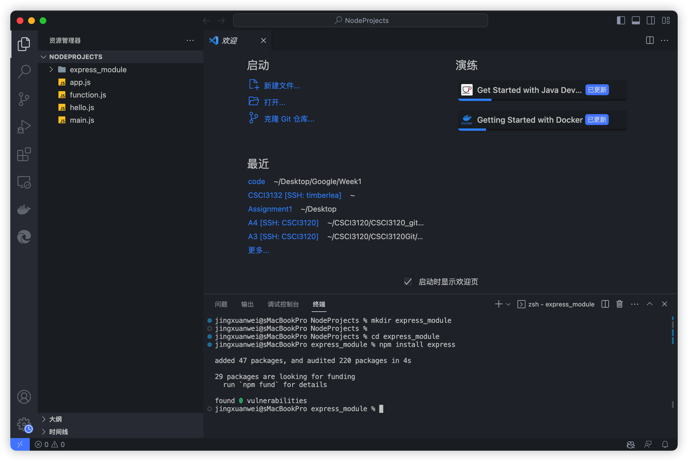
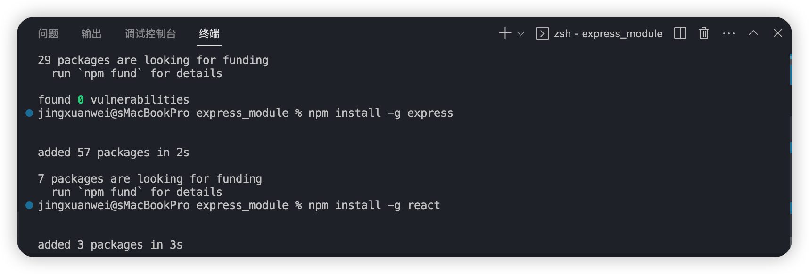
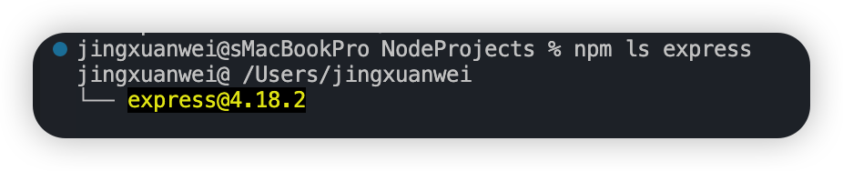
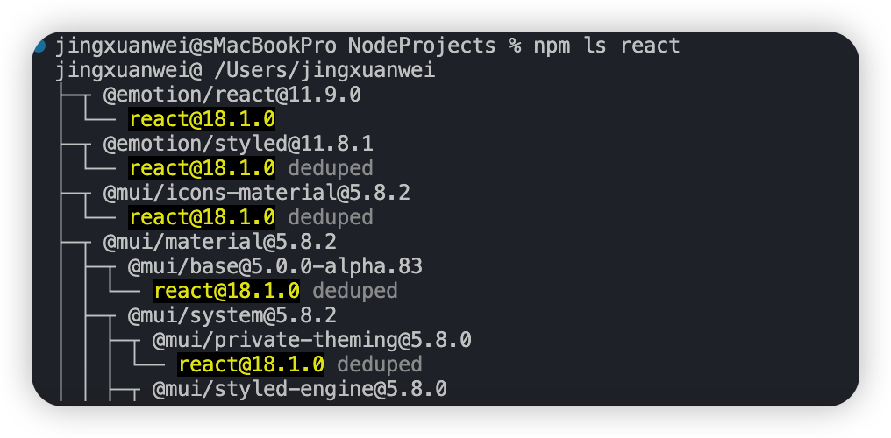
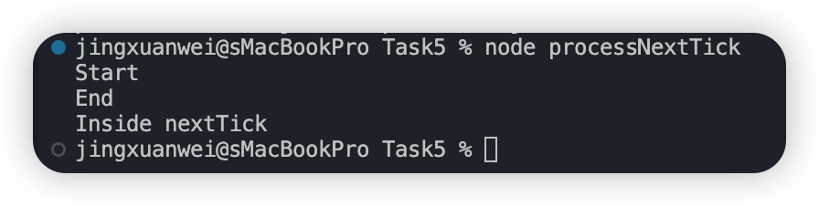
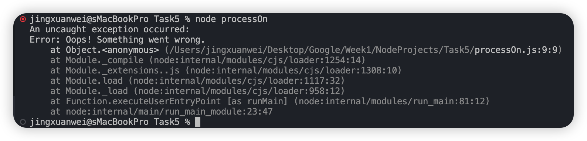
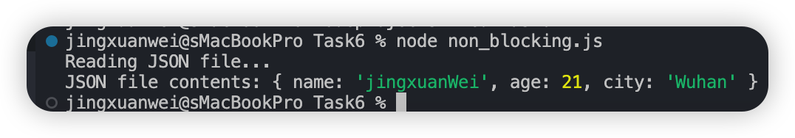
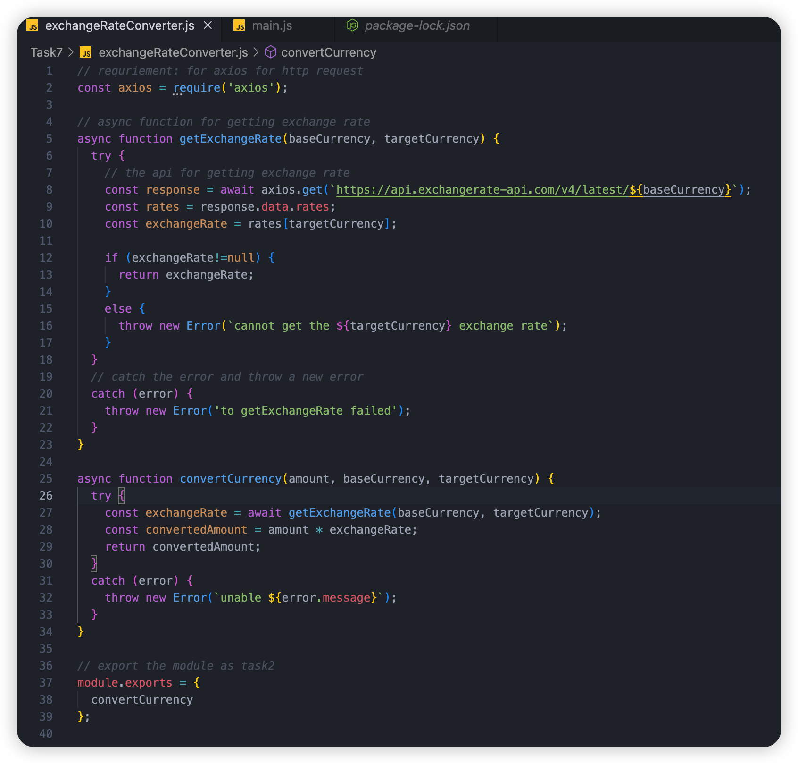
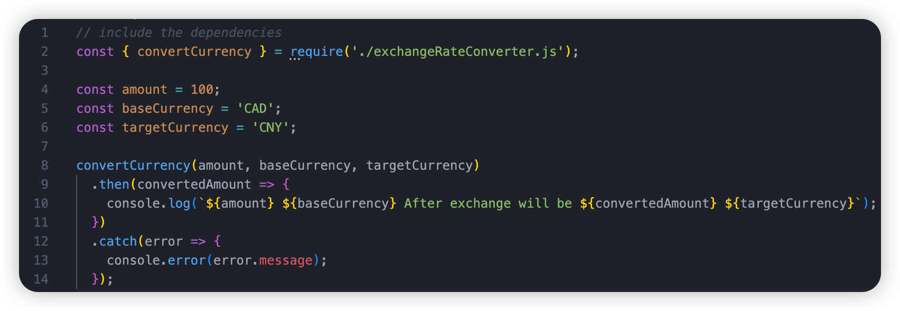

# Week 1

## Environment construction

Install Node.js LTS.Create a new NodeProjects folder in a place you are familiar with, and create a new text and save it as hello.js.

```javascript
console.log('Hello World!');
```

**Save it and run it in terminal:**

```javascript
node hello.js
```

For easy development, it is recommended to install vscode and install the Node.js Extension Pack plug-in.

## Modularity of Node

在计算机程序的开发过程中，随着写的代码越来越多，它变得越来越长，在 一个文件中的可维护性也越来越低。为了写出可维护的代码，我们将许多功能归 入独立的文件，使每个文件包含相对较少的代码，这也是许多编程语言组织代码 的方式。在 Node 环境中，一个.js 文件被称为一个模块。

**使用模块的好处是什么？**

最大的好处是大大提高了代码的可维护性。其次，你不需要从头开始写代码。 当一个模块写完后，它可以在其他地方被引用。当我们写程序时，我们经常引用 其他模块，包括 Node 中内置的模块和第三方的模块。使用模块还可以避免函数和变量名称的冲突。同名的函数和变量可以存在于 不同的模块中，所以我们在编写自己的模块时不必担心与其他模块的名称冲突。

在上一节中，我们写了一个 `hello.js` 文件。hello.js 文件是一个模块。模块的名称就是文件名（减去.js 的后缀），所以 hello.js 文件就是名为 hello 的模块。

1. https://www.liaoxuefeng.com/wiki/1022910821149312/1023027697415616 
2. https://www.runoob.com/nodejs/nodejs-module-system.html


## Task 1

Encapsulate hello as a function and accept the name variable passed in.export it, import it through require in another js file, and make a pass call, and watch the output. （将 hello 封装为一个函数，并接受传入的名称变量。导出它，在另一个 js 文 件中通过 require 导入它，并进行传入调用，观察输出）

### Node.js模块系统

为了让Node.js的文件可以相互调用，Node.js提供了一个简单的模块系统。

模块是Node.js 应用程序的基本组成部分，文件和模块是一一对应的。换言之，一个 Node.js 文件就是一个模块，这个文件可能是JavaScript 代码、JSON 或者编译过的C/C++ 扩展。

> ## 引入模块
>
> 在 Node.js 中，引入一个模块非常简单，如下我们创建一个 **main.js** 文件并引入 hello 模块，代码如下:
>
> ```javascript
> var hello = require('./hello');
> hello.world();
> ```
>
> 以上实例中，代码 require('./hello') 引入了当前目录下的 hello.js 文件（./ 为当前目录，node.js 默认后缀为 js）。
>
> Node.js 提供了 exports 和 require 两个对象，其中 exports 是模块公开的接口，require 用于从外部获取一个模块的接口，即所获取模块的 exports 对象。
>
> 接下来我们就来创建 hello.js 文件，代码如下：
>
> ```javascript
> exports.world = function() {
>   console.log('Hello World');
> }
> ```
>
> 在以上示例中，hello.js 通过 exports 对象把 world 作为模块的访问接口，在 main.js 中通过 require('./hello') 加载这个模块，然后就可以直接访 问 hello.js 中 exports 对象的成员函数了。
>
> 有时候我们只是想把一个对象封装到模块中，格式如下：
>
> ```javascript
> module.exports = function() {
>   // ...
> }
> ```
>
> 例如:
>
> ```javascript
> //hello.js 
> function Hello() { 
>     var name; 
>     this.setName = function(thyName) { 
>         name = thyName; 
>     }; 
>     this.sayHello = function() { 
>         console.log('Hello ' + name); 
>     }; 
> }; 
> module.exports = Hello;
> ```
>
> 这样就可以直接获得这个对象了：
>
> ```javascript
> //main.js 
> var Hello = require('./hello'); 
> hello = new Hello(); 
> hello.setName('BYVoid'); 
> hello.sayHello(); 
> ```
>
> 模块接口的唯一变化是使用 module.exports = Hello 代替了exports.world = function(){}。 在外部引用该模块时，其接口对象就是要输出的 Hello 对象本身，而不是原先的 exports。
>
> ------
>
> ## 服务端的模块放在哪里
>
> 也许你已经注意到，我们已经在代码中使用了模块了。像这样：
>
> ```javascript
> var http = require("http");
> 
> ...
> 
> http.createServer(...);
> ```
>
> Node.js 中自带了一个叫做 **http** 的模块，在我们的代码中请求它并把返回值赋给一个本地变量。
>
> 这把我们的本地变量变成了一个拥有所有 http 模块所提供的公共方法的对象。
>
> Node.js 的 require 方法中的文件查找策略如下：
>
> 由于 Node.js 中存在 4 类模块（原生模块和3种文件模块），尽管 require 方法极其简单，但是内部的加载却是十分复杂的，其加载优先级也各自不同。如下图所示：
>
> 
>
> ### 从文件模块缓存中加载
>
> 尽管原生模块与文件模块的优先级不同，但是都会优先从文件模块的缓存中加载已经存在的模块。
>
> ### 从原生模块加载
>
> 原生模块的优先级仅次于文件模块缓存的优先级。require 方法在解析文件名之后，优先检查模块是否在原生模块列表中。以http模块为例，尽管在目录下存在一个 `http/http.js/http.node/http.json` 文件，require("http") 都不会从这些文件中加载，而是从原生模块中加载。
>
> 原生模块也有一个缓存区，同样也是优先从缓存区加载。如果缓存区没有被加载过，则调用原生模块的加载方式进行加载和执行。
>
> ### 从文件加载
>
> 当文件模块缓存中不存在，而且不是原生模块的时候，Node.js 会解析 require 方法传入的参数，并从文件系统中加载实际的文件，加载过程中的包装和编译细节在前一节中已经介绍过，这里我们将详细描述查找文件模块的过程，其中，也有一些细节值得知晓。
>
> require方法接受以下几种参数的传递：
>
> - http、fs、path等，原生模块。
> - ./mod或../mod，相对路径的文件模块。
> - /pathtomodule/mod，绝对路径的文件模块。
> - mod，非原生模块的文件模块。
>
> 在路径 Y 下执行 require(X) 语句执行顺序：
>
> ```javascript
> 1. 如果 X 是内置模块
>    a. 返回内置模块
>    b. 停止执行
> 2. 如果 X 以 '/' 开头
>    a. 设置 Y 为文件根路径
> 3. 如果 X 以 './' 或 '/' or '../' 开头
>    a. LOAD_AS_FILE(Y + X)
>    b. LOAD_AS_DIRECTORY(Y + X)
> 4. LOAD_NODE_MODULES(X, dirname(Y))
> 5. 抛出异常 "not found"
> 
> LOAD_AS_FILE(X)
> 1. 如果 X 是一个文件, 将 X 作为 JavaScript 文本载入并停止执行。
> 2. 如果 X.js 是一个文件, 将 X.js 作为 JavaScript 文本载入并停止执行。
> 3. 如果 X.json 是一个文件, 解析 X.json 为 JavaScript 对象并停止执行。
> 4. 如果 X.node 是一个文件, 将 X.node 作为二进制插件载入并停止执行。
> 
> LOAD_INDEX(X)
> 1. 如果 X/index.js 是一个文件,  将 X/index.js 作为 JavaScript 文本载入并停止执行。
> 2. 如果 X/index.json 是一个文件, 解析 X/index.json 为 JavaScript 对象并停止执行。
> 3. 如果 X/index.node 是一个文件,  将 X/index.node 作为二进制插件载入并停止执行。
> 
> LOAD_AS_DIRECTORY(X)
> 1. 如果 X/package.json 是一个文件,
>    a. 解析 X/package.json, 并查找 "main" 字段。
>    b. let M = X + (json main 字段)
>    c. LOAD_AS_FILE(M)
>    d. LOAD_INDEX(M)
> 2. LOAD_INDEX(X)
> 
> LOAD_NODE_MODULES(X, START)
> 1. let DIRS=NODE_MODULES_PATHS(START)
> 2. for each DIR in DIRS:
>    a. LOAD_AS_FILE(DIR/X)
>    b. LOAD_AS_DIRECTORY(DIR/X)
> 
> NODE_MODULES_PATHS(START)
> 1. let PARTS = path split(START)
> 2. let I = count of PARTS - 1
> 3. let DIRS = []
> 4. while I >= 0,
>    a. if PARTS[I] = "node_modules" CONTINUE
>    b. DIR = path join(PARTS[0 .. I] + "node_modules")
>    c. DIRS = DIRS + DIR
>    d. let I = I - 1
> 5. return DIRS
> ```
>
> **exports 和 module.exports 的使用**
>
> 如果要对外暴露属性或方法，就用 **exports** 就行，要暴露对象(类似class，包含了很多属性和方法)，就用 **module.exports**。

## Task2

Wrap multiple simple functions with module.export and see how the different functions are referenced separately in another js file.

**Package Manager NPM Getting Started & Exploring JavaScript features**

https://www.runoob.com/nodejs/nodejs-npm.html

Here, we recommend that domestic users replace the mirror source of npm to greatly improve the development speed.You can use the nrm tool to quickly change the image source. Open terminal and type:

```shell
npm install -g nrm

nrm use taobao
```

### function.js

```javascript
function add(a, b) {
    return a + b;
  }
  
  function subtract(a, b) {
    return a - b;
  }
  
  function multiply(a, b) {
    return a * b;
  }
  
  module.exports = {
    add,
    subtract,
    multiply
  };
  
```

### Main.js

```javascript
const { add, subtract, multiply } = require('./functions');

console.log(add(2, 3)); // Output: 5
console.log(subtract(5, 2)); // Output: 3
console.log(multiply(4, 6)); // Output: 24

```


## Task 3

Create a new folder in the `NodeProjects` folder, `express_tutorial`, as your project learning directory, and install the express framework locally.

```shell
mkdir express_module

cd express_module

npm install express
```



## Task 4

Install express and react globally (although you probably won't use react in this project) 在全局范围内安装Express和react（尽管你可能不会在这个项目中使用react）。

```bash
npm install -g express
npm install -g react
```

Install the `express` and `react` package







## Task 5

https://www.liaoxuefeng.com/wiki/1022910821149312/1023025732384672 	

Experience the use of `process.nextTick()` and `process.on()` functions to understand the node lifecycle management mechanism

**Node asynchronous and callback**

process.nextTick() 和 process.on() 是 Node.js 中的重要函数，用于管理 Node.js 的事件循环和处理异步操作的机制。

`process.nextTick()`
process.nextTick() 是一个特殊的函数，它允许您安排一个回调函数在下一个事件循环迭代中执行。它确保该回调函数在任何其他 I/O 事件或定时器之前执行。这个函数通常用于将函数的执行推迟到当前操作完成之后。

下面是一个使用 process.nextTick() 的示例：

```javascript
console.log('Start');

process.nextTick(() => {

  console.log('Inside nextTick');

});

console.log('End');
```



传递给 process.nextTick() 的回调函数在事件循环的下一个迭代之前执行，即使它出现在第二个 console.log() 语句之后。

`process.on()`
process.on() 用于为 Node.js 进程注册事件处理程序。它允许您监听并响应特定的事件，例如未捕获的异常、进程终止和信号等。

下面是一个使用 process.on() 来处理未捕获异常的示例：

```javascript
process.on('uncaughtException', (err) => {
    console.error('An uncaught exception occurred:');
    console.error(err);
    // Perform any necessary cleanup or logging
    process.exit(1);
  });
  
  // Simulate an uncaught exception
  throw new Error('Oops! Something went wrong.');
```

在这个例子中，通过 process.on() 注册了 uncaughtException 事件。如果在脚本执行过程中出现未捕获的异常，注册的事件处理程序将被调用。它允许您记录错误、执行清理操作，并优雅地退出进程。

需要注意的是，uncaughtException 事件是处理未处理异常的最后一道防线。通常建议在代码中使用 try/catch 块来处理异常，以确保正确的错误处理和防止意外的应用程序行为。

这些函数以及其他 Node.js 的特性和 API，共同构成了 Node.js 异步和回调驱动的特性，使得能够高效处理 I/O 操作并实现可扩展性。



## Task 6 

https://www.runoob.com/nodejs/nodejs-callback.html 

Create a non-blocking function that attempts to read a json file and print it directly, or prints a failure message on failure.

下面是一个在Node.js中创建的非阻塞函数示例，该函数尝试读取一个JSON文件并在成功时直接打印内容，失败时打印失败消息：

```javascript
const fs = require('fs');

function readJsonFile(filename) {
  fs.readFile(filename, 'utf8', (err, data) => {
    if (err) {
      console.error('Failed to read JSON file:', err.message);
      return;
    }

    try {
      const jsonData = JSON.parse(data);
      console.log('JSON file contents:', jsonData);
    } 
    catch (parseError) {
      console.error('Failed to parse JSON:', parseError.message);
    }
  });
}

// Usage example
readJsonFile('data.json');
console.log('Reading JSON file...');
```
在这个示例中，readJsonFile 函数接受一个文件名作为参数。它使用 fs.readFile 函数异步地读取文件。如果在读取过程中发生错误，它将打印带有错误详细信息的失败消息。如果成功读取文件，它将尝试将内容解析为JSON。如果JSON解析失败，它将打印带有解析错误详细信息的失败消息。如果成功解析JSON，它将打印JSON数据。

**请注意，该函数不会阻塞代码的执行**。它启动文件读取操作并继续执行后续的代码行。文件的读取和解析是异步进行的，并且结果在提供给 fs.readFile 的回调函数中处理。

```json
{
    "name": "jingxuanWei",
    "age": 21,
    "city": "Wuhan"
}
```



## Task 7

> ### [深入理解nodejs中的异步编程](https://segmentfault.com/a/1190000038998601)
>
> ##### 简介
>
> 因为javascript默认情况下是单线程的，这意味着代码不能创建新的线程来并行执行。但是对于最开始在浏览器中运行的javascript来说，单线程的同步执行环境显然无法满足页面点击，鼠标移动这些响应用户的功能。于是浏览器实现了一组API，可以让javascript以回调的方式来异步响应页面的请求事件。
>
> 更进一步，nodejs引入了非阻塞的 I/O ，从而将异步的概念扩展到了文件访问、网络调用等。
>
> 今天，我们将会深入的探讨一下各种异步编程的优缺点和发展趋势。
>
> ##### 同步异步和阻塞非阻塞
>
> 在讨论nodejs的异步编程之前，让我们来讨论一个比较容易混淆的概念，那就是同步，异步，阻塞和非阻塞。
>
> 所谓阻塞和非阻塞是指进程或者线程在进行操作或者数据读写的时候，是否需要等待，在等待的过程中能否进行其他的操作。
>
> 如果需要等待，并且等待过程中线程或进程无法进行其他操作，只能傻傻的等待，那么我们就说这个操作是阻塞的。
>
> 反之，如果进程或者线程在进行操作或者数据读写的过程中，还可以进行其他的操作，那么我们就说这个操作是非阻塞的。
>
> 同步和异步，是指访问数据的方式，同步是指需要主动读取数据，这个读取过程可能是阻塞或者是非阻塞的。而异步是指并不需要主动去读取数据，是被动的通知。
>
> 很明显，javascript中的回调是一个被动的通知，我们可以称之为异步调用。
>
> ##### javascript中的回调
>
> javascript中的回调是异步编程的一个非常典型的例子：
>
> ```javascript
> document.getElementById('button').addEventListener('click', () => {
>   console.log('button clicked!');
> })
> ```
>
> 上面的代码中，我们为button添加了一个click事件监听器，如果监听到了click事件，则会出发回调函数，输出相应的信息。
>
> 回调函数就是一个普通的函数，只不过它被作为参数传递给了addEventListener，并且只有事件触发的时候才会被调用。
>
> 上篇文章我们讲到的setTimeout和setInterval实际上都是异步的回调函数。
>
> ##### 回调函数的错误处理
>
> 在nodejs中怎么处理回调的错误信息呢？nodejs采用了一个非常巧妙的办法，在nodejs中，任何回调函数中的第一个参数为错误对象，我们可以通过判断这个错误对象的存在与否，来进行相应的错误处理。
>
> ```javascript
> fs.readFile('/文件.json', (err, data) => {
>   if (err !== null) {
>     //处理错误
>     console.log(err)
>     return
>   }
> 
>   //没有错误，则处理数据。
>   console.log(data)
> })
> ```
>
> ##### 回调地狱
>
> javascript的回调虽然非常的优秀，它有效的解决了同步处理的问题。但是遗憾的是，如果我们需要依赖回调函数的返回值来进行下一步的操作的时候，就会陷入这个回调地狱。
>
> 叫回调地狱有点夸张了，但是也是从一方面反映了回调函数所存在的问题。
>
> ```javascript
> fs.readFile('/a.json', (err, data) => {
>   if (err !== null) {
>     fs.readFile('/b.json',(err,data) =>{
>         //callback inside callback
>     })
>   }
> })
> ```
>
> 怎么解决呢？
>
> 别怕ES6引入了Promise，ES2017引入了Async/Await都可以解决这个问题。
>
> ### ES6中的Promise
>
> #### 什么是Promise
>
> Promise 是异步编程的一种解决方案，比传统的解决方案“回调函数和事件”更合理和更强大。
>
> 所谓Promise，简单说就是一个容器，里面保存着某个未来才会结束的事件（通常是一个异步操作）的结果。
>
> 从语法上说，Promise 是一个对象，从它可以获取异步操作的消息。
>
> #### Promise的特点
>
> Promise有两个特点：
>
> 1. 对象的状态不受外界影响。
>
> Promise对象代表一个异步操作，有三种状态：Pending（进行中）、Resolved（已完成，又称 Fulfilled）和Rejected（已失败）。
>
> 只有异步操作的结果，可以决定当前是哪一种状态，任何其他操作都无法改变这个状态。
>
> 1. 一旦状态改变，就不会再变，任何时候都可以得到这个结果。
>
> Promise对象的状态改变，只有两种可能：从Pending变为Resolved和从Pending变为Rejected。
>
> 这与事件（Event）完全不同，事件的特点是，如果你错过了它，再去监听，是得不到结果的。
>
> #### Promise的优点
>
> Promise将异步操作以同步操作的流程表达出来，避免了层层嵌套的回调函数。
>
> Promise对象提供统一的接口，使得控制异步操作更加容易。
>
> #### Promise的缺点
>
> 1. 无法取消Promise，一旦新建它就会立即执行，无法中途取消。
> 2. 如果不设置回调函数，Promise内部抛出的错误，不会反应到外部。
> 3. 当处于Pending状态时，无法得知目前进展到哪一个阶段（刚刚开始还是即将完成）。
>
> #### Promise的用法
>
> Promise对象是一个构造函数，用来生成Promise实例：
>
> ```javascript
> var promise = new Promise(function(resolve, reject) { 
> // ... some code 
> if (/* 异步操作成功 */){ 
> resolve(value); 
> } else { reject(error); } 
> }
> );
> ```
>
> promise可以接then操作，then操作可以接两个function参数，第一个function的参数就是构建Promise的时候resolve的value，第二个function的参数就是构建Promise的reject的error。
>
> ```javascript
> promise.then(function(value) { 
> // success 
> }, function(error) { 
> // failure }
> );
> ```
>
> 我们看一个具体的例子：
>
> ```javascript
> function timeout(ms){
>     return new Promise(((resolve, reject) => {
>         setTimeout(resolve,ms,'done');
>     }))
> }
> 
> timeout(100).then(value => console.log(value));
> ```
>
> Promise中调用了一个setTimeout方法，并会定时触发resolve方法，并传入参数done。
>
> 最后程序输出done。
>
> #### Promise的执行顺序
>
> Promise一经创建就会立马执行。但是Promise.then中的方法，则会等到一个调用周期过后再次调用，我们看下面的例子：
>
> ```javascript
> let promise = new Promise(((resolve, reject) => {
>     console.log('Step1');
>     resolve();
> }));
> 
> promise.then(() => {
>     console.log('Step3');
> });
> 
> console.log('Step2');
> 
> 输出：
> Step1
> Step2
> Step3
> ```
>
> ### async和await
>
> Promise当然很好，我们将回调地狱转换成了链式调用。我们用then来将多个Promise连接起来，前一个promise resolve的结果是下一个promise中then的参数。
>
> 链式调用有什么缺点呢？
>
> 比如我们从一个promise中，resolve了一个值，我们需要根据这个值来进行一些业务逻辑的处理。
>
> 假如这个业务逻辑很长，我们就需要在下一个then中写很长的业务逻辑代码。这样让我们的代码看起来非常的冗余。
>
> 那么有没有什么办法可以直接返回promise中resolve的结果呢？
>
> 答案就是await。
>
> 当promise前面加上await的时候，调用的代码就会停止直到 promise 被解决或被拒绝。
>
> 注意await一定要放在async函数中，我们来看一个async和await的例子：
>
> ```javascript
> const logAsync = () => {
>   return new Promise(resolve => {
>     setTimeout(() => resolve('小马哥'), 5000)
>   })
> }
> ```
>
> 上面我们定义了一个logAsync函数，该函数返回一个Promise，因为该Promise内部使用了setTimeout来resolve，所以我们可以将其看成是异步的。
>
> 要是使用await得到resolve的值，我们需要将其放在一个async的函数中：
>
> ```javascript
> const doSomething = async () => {
>   const resolveValue = await logAsync();
>   console.log(resolveValue);
> }
> ```
>
> #### async的执行顺序
>
> await实际上是去等待promise的resolve结果我们把上面的例子结合起来：
>
> ```javascript
> const logAsync = () => {
>     return new Promise(resolve => {
>         setTimeout(() => resolve('小马哥'), 1000)
>     })
> }
> 
> const doSomething = async () => {
>     const resolveValue = await logAsync();
>     console.log(resolveValue);
> }
> 
> console.log('before')
> doSomething();
> console.log('after')
> ```
>
> 上面的例子输出：
>
> ```javascript
> before
> after
> 小马哥
> ```
>
> 可以看到，aysnc是异步执行的，并且它的顺序是在当前这个周期之后。
>
> #### async的特点
>
> async会让所有后面接的函数都变成Promise，即使后面的函数没有显示的返回Promise。
>
> ```javascript
> const asyncReturn = async () => {
>     return 'async return'
> }
> 
> asyncReturn().then(console.log)
> ```
>
> 因为只有Promise才能在后面接then，我们可以看出async将一个普通的函数封装成了一个Promise：
>
> ```javascript
> const asyncReturn = async () => {
>     return Promise.resolve('async return')
> }
> 
> asyncReturn().then(console.log)
> ```
>
> ### 总结
>
> promise避免了回调地狱，它将callback inside callback改写成了then的链式调用形式。
>
> 但是链式调用并不方便阅读和调试。于是出现了async和await。
>
> async和await将链式调用改成了类似程序顺序执行的语法，从而更加方便理解和调试。
>
> 我们来看一个对比，先看下使用Promise的情况：
>
> ```javascript
> const getUserInfo = () => {
>   return fetch('/users.json') // 获取用户列表
>     .then(response => response.json()) // 解析 JSON
>     .then(users => users[0]) // 选择第一个用户
>     .then(user => fetch(`/users/${user.name}`)) // 获取用户数据
>     .then(userResponse => userResponse.json()) // 解析 JSON
> }
> 
> getUserInfo()
> ```
>
> 将其改写成async和await：
>
> ```javascript
> const getUserInfo = async () => {
>   const response = await fetch('/users.json') // 获取用户列表
>   const users = await response.json() // 解析 JSON
>   const user = users[0] // 选择第一个用户
>   const userResponse = await fetch(`/users/${user.name}`) // 获取用户数据
>   const userData = await userResponse.json() // 解析 JSON
>   return userData
> }
> 
> getUserInfo()
> ```
>
> 可以看到业务逻辑变得更加清晰。同时，我们获取到了很多中间值，这样也方便我们进行调试
>
> Follow the instructions above to understand the writing of the asynchronous function and to implement the exchange rate converter for use in subsequent projects.

### exchange rate converter

1. 初始化一个新的 Node.js 项目：

   ```bash
   npm init -y
   ```

2. 安装 `axios` 包，用于向汇率 API 发送 HTTP 请求。运行以下命令：

   ```bash
   npm install axios
   ```

3. Code

   

4. 使用这个汇率转换器 在main.js中

   

   