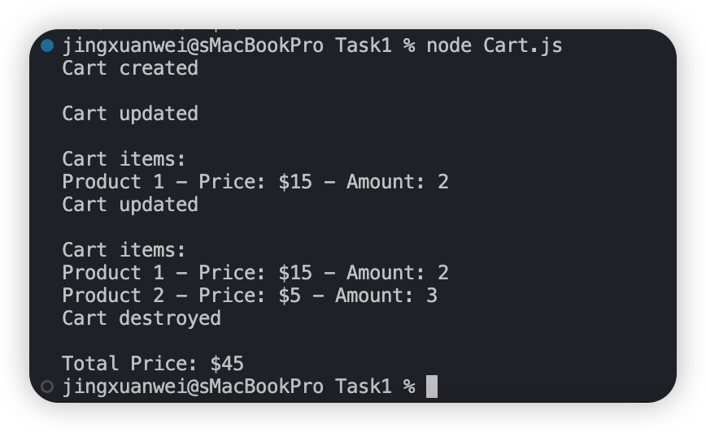
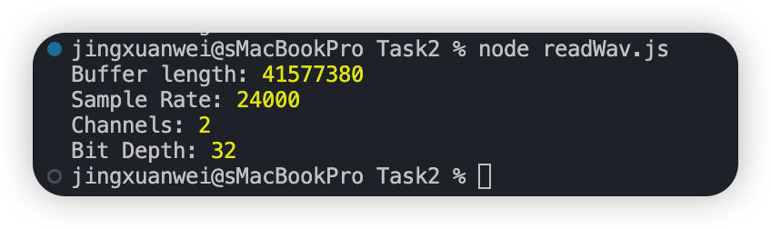
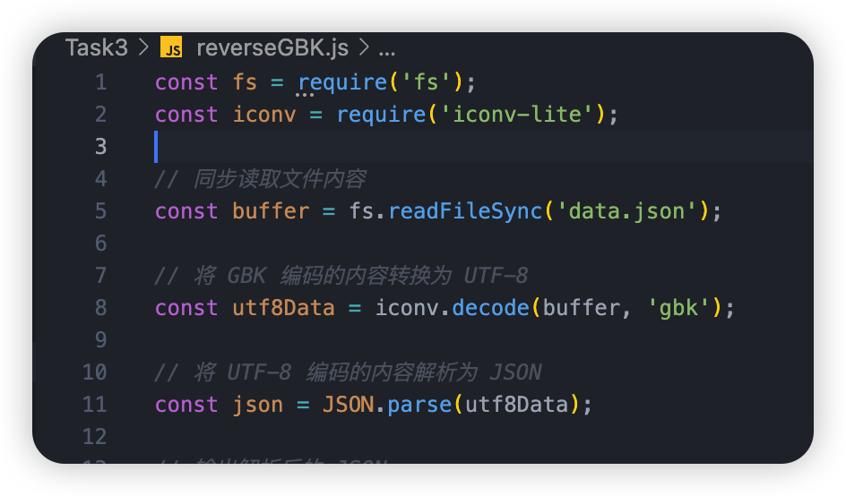
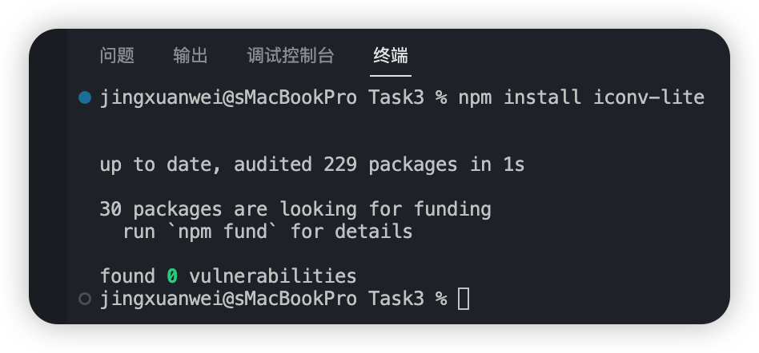
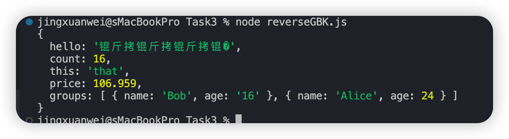
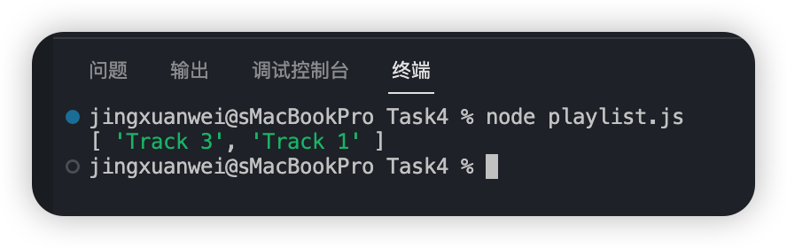
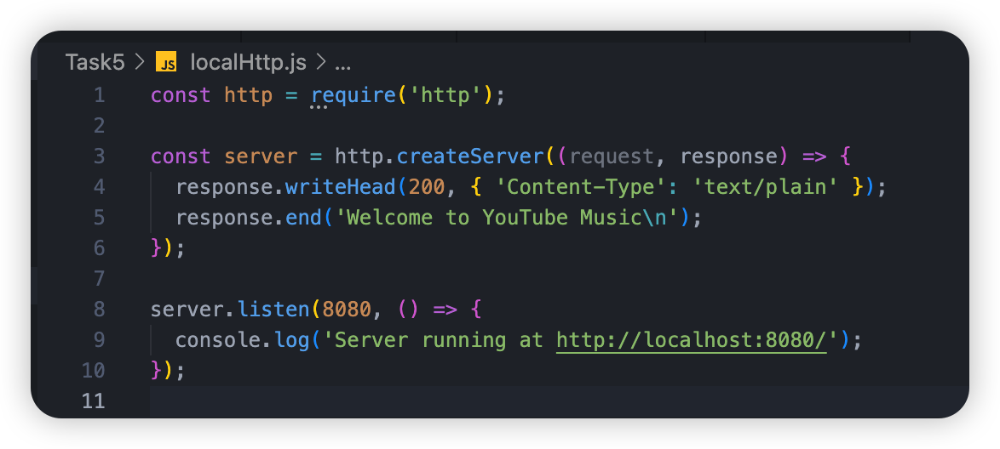
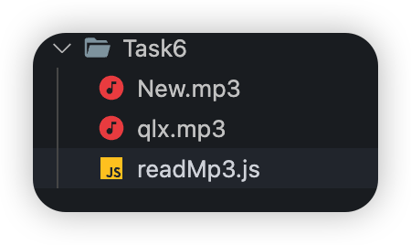
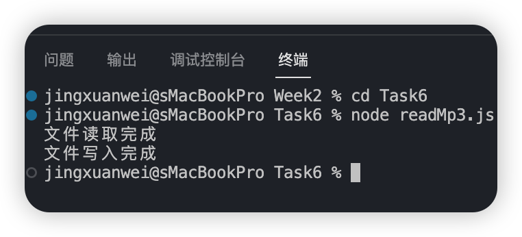

# **Week 2**

## **Node.js** 进阶和 **HTTP** 入门 **Node** 事件循环（Intro）

1. https://www.runoob.com/nodejs/nodejs-event-loop.html 

## Node.js 事件循环

Node.js 是单进程单线程应用程序，但是因为 V8 引擎提供的异步执行回调接口，通过这些接口可以处理大量的并发，所以性能非常高。

Node.js 几乎每一个 API 都是支持回调函数的。

Node.js 基本上所有的事件机制都是用设计模式中观察者模式实现。

Node.js 单线程类似进入一个while(true)的事件循环，直到没有事件观察者退出，每个异步事件都生成一个事件观察者，如果有事件发生就调用该回调函数.

------

### 事件驱动程序

Node.js 使用事件驱动模型，当web server接收到请求，就把它关闭然后进行处理，然后去服务下一个web请求。

当这个请求完成，它被放回处理队列，当到达队列开头，这个结果被返回给用户。

这个模型非常高效可扩展性非常强，因为 webserver 一直接受请求而不等待任何读写操作。（这也称之为非阻塞式IO或者事件驱动IO）

在事件驱动模型中，会生成一个主循环来监听事件，当检测到事件时触发回调函数。


整个事件驱动的流程就是这么实现的，非常简洁。有点类似于观察者模式，事件相当于一个主题(Subject)，而所有注册到这个事件上的处理函数相当于观察者(Observer)。

Node.js 有多个内置的事件，我们可以通过引入 events 模块，并通过实例化 EventEmitter 类来绑定和监听事件，如下实例：

```js
// 引入 events 模块
var events = require('events');
// 创建 eventEmitter 对象
var eventEmitter = new events.EventEmitter();
```

以下程序绑定事件处理程序：

```js
// 绑定事件及事件的处理程序
eventEmitter.on('eventName', eventHandler);
```

我们可以通过程序触发事件：

```js
// 触发事件
eventEmitter.emit('eventName');
```

### 实例

创建 main.js 文件，代码如下所示：

```js
// 引入 events 模块
var events = require('events');
// 创建 eventEmitter 对象
var eventEmitter = new events.EventEmitter();
 
// 创建事件处理程序
var connectHandler = function connected() {
   console.log('连接成功。');
  
   // 触发 data_received 事件 
   eventEmitter.emit('data_received');
}
 
// 绑定 connection 事件处理程序
eventEmitter.on('connection', connectHandler);
 
// 使用匿名函数绑定 data_received 事件
eventEmitter.on('data_received', function(){
   console.log('数据接收成功。');
});
 
// 触发 connection 事件 
eventEmitter.emit('connection');
 
console.log("程序执行完毕。");
```

接下来让我们执行以上代码：

```bash
$ node main.js
连接成功。
数据接收成功。
程序执行完毕。
```

------

### Node 应用程序是如何工作的？

在 Node 应用程序中，执行异步操作的函数将回调函数作为最后一个参数， 回调函数接收错误对象作为第一个参数。

接下来让我们来重新看下前面的实例，创建一个 input.txt ,文件内容如下：

```
菜鸟教程官网地址：www.runoob.com
```

创建 main.js 文件，代码如下：

```js
var fs = require("fs");

fs.readFile('input.txt', function (err, data) {
   if (err){
      console.log(err.stack);
      return;
   }
   console.log(data.toString());
});
console.log("程序执行完毕");
```

以上程序中 fs.readFile() 是异步函数用于读取文件。 如果在读取文件过程中发生错误，错误 err 对象就会输出错误信息。

如果没发生错误，readFile 跳过 err 对象的输出，文件内容就通过回调函数输出。

执行以上代码，执行结果如下：

```bash
程序执行完毕
菜鸟教程官网地址：www.runoob.com
```

接下来我们删除 input.txt 文件，执行结果如下所示：

```bash
程序执行完毕
Error: ENOENT, open 'input.txt'
```

因为文件 input.txt 不存在，所以输出了错误信息。

1. https://www.runoob.com/nodejs/nodejs-event.html

## Node.js EventEmitter

Node.js 所有的异步 I/O 操作在完成时都会发送一个事件到事件队列。

Node.js 里面的许多对象都会分发事件：一个 net.Server 对象会在每次有新连接时触发一个事件， 一个 fs.readStream 对象会在文件被打开的时候触发一个事件。 所有这些产生事件的对象都是 events.EventEmitter 的实例。

------

### EventEmitter 类

events 模块只提供了一个对象： events.EventEmitter。EventEmitter 的核心就是事件触发与事件监听器功能的封装。

你可以通过require("events");来访问该模块。

```js
// 引入 events 模块
var events = require('events');
// 创建 eventEmitter 对象
var eventEmitter = new events.EventEmitter();
```

EventEmitter 对象如果在实例化时发生错误，会触发 error 事件。当添加新的监听器时，newListener 事件会触发，当监听器被移除时，removeListener 事件被触发。

下面我们用一个简单的例子说明 EventEmitter 的用法：

```js
//event.js 文件
var EventEmitter = require('events').EventEmitter; 
var event = new EventEmitter(); 
event.on('some_event', function() { 
    console.log('some_event 事件触发'); 
}); 
setTimeout(function() { 
    event.emit('some_event'); 
}, 1000); 
```

执行结果如下：

运行这段代码，1 秒后控制台输出了 **'some_event 事件触发'**。其原理是 event 对象注册了事件 some_event 的一个监听器，然后我们通过 setTimeout 在 1000 毫秒以后向 event 对象发送事件 some_event，此时会调用some_event 的监听器。

```bash
$ node event.js 
some_event 事件触发
```

EventEmitter 的每个事件由一个事件名和若干个参数组成，事件名是一个字符串，通常表达一定的语义。对于每个事件，EventEmitter 支持 若干个事件监听器。

当事件触发时，注册到这个事件的事件监听器被依次调用，事件参数作为回调函数参数传递。

让我们以下面的例子解释这个过程：

```js
//event.js 文件
var events = require('events'); 
var emitter = new events.EventEmitter(); 
emitter.on('someEvent', function(arg1, arg2) { 
    console.log('listener1', arg1, arg2); 
}); 
emitter.on('someEvent', function(arg1, arg2) { 
    console.log('listener2', arg1, arg2); 
}); 
emitter.emit('someEvent', 'arg1 参数', 'arg2 参数'); 
```

执行以上代码，运行的结果如下：

```bash
$ node event.js 
listener1 arg1 参数 arg2 参数
listener2 arg1 参数 arg2 参数
```

以上例子中，emitter 为事件 someEvent 注册了两个事件监听器，然后触发了 someEvent 事件。

运行结果中可以看到两个事件监听器回调函数被先后调用。 这就是EventEmitter最简单的用法。

EventEmitter 提供了多个属性，如 **on** 和 **emit**。

**on** 函数用于绑定事件函数，**emit** 属性用于触发一个事件。接下来我们来具体看下 EventEmitter 的属性介绍。

### 方法

| 序号 | 方法 & 描述                                                  |
| :--: | :----------------------------------------------------------- |
|  1   | **addListener(event, listener)** 为指定事件添加一个监听器到监听器数组的尾部。 |
|  2   | **on(event, listener)** 为指定事件注册一个监听器，接受一个字符串 event 和一个回调函数。`server.on('connection', function (stream) {  console.log('someone connected!'); });` |
|  3   | **once(event, listener)** 为指定事件注册一个单次监听器，即 监听器最多只会触发一次，触发后立刻解除该监听器。`server.once('connection', function (stream) { console.log('Ah, we have our first user!'); });` |
|  4   | **removeListener(event, listener)** 移除指定事件的某个监听器，监听器必须是该事件已经注册过的监听器。它接受两个参数，第一个是事件名称，第二个是回调函数名称。`var callback = function(stream) {  console.log('someone connected!'); }; server.on('connection', callback); // ... server.removeListener('connection', callback);` |
|  5   | **removeAllListeners([event])** 移除所有事件的所有监听器， 如果指定事件，则移除指定事件的所有监听器。 |
|  6   | **setMaxListeners(n)** 默认情况下， EventEmitters 如果你添加的监听器超过 10 个就会输出警告信息。 setMaxListeners 函数用于改变监听器的默认限制的数量。 |
|  7   | **listeners(event)** 返回指定事件的监听器数组。              |
|  8   | **emit(event, [arg1], [arg2], [...])** 按监听器的顺序执行执行每个监听器，如果事件有注册监听返回 true，否则返回 false。 |

### 类方法

| 序号 | 方法 & 描述                                                  |
| :--- | :----------------------------------------------------------- |
| 1    | **listenerCount(emitter, event)** 返回指定事件的监听器数量。 |

```js
events.EventEmitter.listenerCount(emitter, eventName) //已废弃，不推荐
events.emitter.listenerCount(eventName) //推荐
```

### 事件

| 序号 | 事件 & 描述                                                  |
| :--- | :----------------------------------------------------------- |
| 1    | **newListener** 1. **event** - 字符串，事件名称. 2. **listener** - 处理事件函数该事件在添加新监听器时被触发。 |
| 2    | **removeListener** 1.**event** - 字符串，事件名称 2. **listener** - 处理事件函数从指定监听器数组中删除一个监听器。需要注意的是，此操作将会改变处于被删监听器之后的那些监听器的索引。 |

### 实例

以下实例通过 connection（连接）事件演示了 EventEmitter 类的应用。

创建 main.js 文件，代码如下：

```js
var events = require('events');
var eventEmitter = new events.EventEmitter();

// 监听器 #1
var listener1 = function listener1() {
   console.log('监听器 listener1 执行。');
}

// 监听器 #2
var listener2 = function listener2() {
  console.log('监听器 listener2 执行。');
}

// 绑定 connection 事件，处理函数为 listener1 
eventEmitter.addListener('connection', listener1);

// 绑定 connection 事件，处理函数为 listener2
eventEmitter.on('connection', listener2);

var eventListeners = eventEmitter.listenerCount('connection');
console.log(eventListeners + " 个监听器监听连接事件。");

// 处理 connection 事件 
eventEmitter.emit('connection');

// 移除监绑定的 listener1 函数
eventEmitter.removeListener('connection', listener1);
console.log("listener1 不再受监听。");

// 触发连接事件
eventEmitter.emit('connection');

eventListeners = eventEmitter.listenerCount('connection');
console.log(eventListeners + " 个监听器监听连接事件。");

console.log("程序执行完毕。");
```

以上代码，执行结果如下所示：

```bash
$ node main.js
2 个监听器监听连接事件。
监听器 listener1 执行。
监听器 listener2 执行。
listener1 不再受监听。
监听器 listener2 执行。
1 个监听器监听连接事件。
程序执行完毕。
```

------

### error 事件

EventEmitter 定义了一个特殊的事件 error，它包含了错误的语义，我们在遇到 异常的时候通常会触发 error 事件。

当 error 被触发时，EventEmitter 规定如果没有响 应的监听器，Node.js 会把它当作异常，退出程序并输出错误信息。

我们一般要为会触发 error 事件的对象设置监听器，避免遇到错误后整个程序崩溃。例如：

```js
var events = require('events'); 
var emitter = new events.EventEmitter(); 
emitter.emit('error'); 
```

运行时会显示以下错误：

```bash
node.js:201 
throw e; // process.nextTick error, or 'error' event on first tick 
^ 
Error: Uncaught, unspecified 'error' event. 
at EventEmitter.emit (events.js:50:15) 
at Object.<anonymous> (/home/byvoid/error.js:5:9) 
at Module._compile (module.js:441:26) 
at Object..js (module.js:459:10) 
at Module.load (module.js:348:31) 
at Function._load (module.js:308:12) 
at Array.0 (module.js:479:10) 
at EventEmitter._tickCallback (node.js:192:40) 
```

------

### 继承 EventEmitter

大多数时候我们不会直接使用 EventEmitter，而是在对象中继承它。包括 fs、net、 http 在内的，只要是支持事件响应的核心模块都是 EventEmitter 的子类。

为什么要这样做呢？原因有两点：

首先，具有某个实体功能的对象实现事件符合语义， 事件的监听和发生应该是一个对象的方法。

其次 JavaScript 的对象机制是基于原型的，支持 部分多重继承，继承 EventEmitter 不会打乱对象原有的继承关系。

## 任务1

**Node FS** 和 **Buffer**

### FS

https://www.liaoxuefeng.com/wiki/1022910821149312/1023025763380448

------

Node.js内置的`fs`模块就是文件系统模块，负责读写文件。

和所有其它JavaScript模块不同的是，`fs`模块同时提供了异步和同步的方法。

回顾一下什么是异步方法。因为JavaScript的单线程模型，执行IO操作时，JavaScript代码无需等待，而是传入回调函数后，继续执行后续JavaScript代码。比如jQuery提供的`getJSON()`操作：

```js
$.getJSON('http://example.com/ajax', function (data) {
    console.log('IO结果返回后执行...');
});
console.log('不等待IO结果直接执行后续代码...');
```

而同步的IO操作则需要等待函数返回：

```js
// 根据网络耗时，函数将执行几十毫秒~几秒不等:
var data = getJSONSync('http://example.com/ajax');
```

同步操作的好处是代码简单，缺点是程序将等待IO操作，在等待时间内，无法响应其它任何事件。而异步读取不用等待IO操作，但代码较麻烦。

#### 异步读文件

按照JavaScript的标准，异步读取一个文本文件的代码如下：

```js
'use strict';

var fs = require('fs');

fs.readFile('sample.txt', 'utf-8', function (err, data) {
    if (err) {
        console.log(err);
    } else {
        console.log(data);
    }
});
```

请注意，`sample.txt`文件必须在当前目录下，且文件编码为`utf-8`。

异步读取时，传入的回调函数接收两个参数，当正常读取时，`err`参数为`null`，`data`参数为读取到的String。当读取发生错误时，`err`参数代表一个错误对象，`data`为`undefined`。这也是Node.js标准的回调函数：第一个参数代表错误信息，第二个参数代表结果。后面我们还会经常编写这种回调函数。

由于`err`是否为`null`就是判断是否出错的标志，所以通常的判断逻辑总是：

```js
if (err) {
    // 出错了
} else {
    // 正常
}
```

如果我们要读取的文件不是文本文件，而是二进制文件，怎么办？

下面的例子演示了如何读取一个图片文件：

```js
'use strict';

var fs = require('fs');

fs.readFile('sample.png', function (err, data) {
    if (err) {
        console.log(err);
    } else {
        console.log(data);
        console.log(data.length + ' bytes');
    }
});
```

当读取二进制文件时，不传入文件编码时，回调函数的`data`参数将返回一个`Buffer`对象。在Node.js中，`Buffer`对象就是一个包含零个或任意个字节的数组（注意和Array不同）。

`Buffer`对象可以和String作转换，例如，把一个`Buffer`对象转换成String：

```js
// Buffer -> String
var text = data.toString('utf-8');
console.log(text);
```

或者把一个String转换成`Buffer`：

```js
// String -> Buffer
var buf = Buffer.from(text, 'utf-8');
console.log(buf);
```

#### 同步读文件

除了标准的异步读取模式外，`fs`也提供相应的同步读取函数。同步读取的函数和异步函数相比，多了一个`Sync`后缀，并且不接收回调函数，函数直接返回结果。

用`fs`模块同步读取一个文本文件的代码如下：

```js
'use strict';

var fs = require('fs');

var data = fs.readFileSync('sample.txt', 'utf-8');
console.log(data);
```

可见，原异步调用的回调函数的`data`被函数直接返回，函数名需要改为`readFileSync`，其它参数不变。

如果同步读取文件发生错误，则需要用`try...catch`捕获该错误：

```js
try {
    var data = fs.readFileSync('sample.txt', 'utf-8');
    console.log(data);
} catch (err) {
    // 出错了
}
```

#### 写文件

将数据写入文件是通过`fs.writeFile()`实现的：

```js
'use strict';

var fs = require('fs');

var data = 'Hello, Node.js';
fs.writeFile('output.txt', data, function (err) {
    if (err) {
        console.log(err);
    } else {
        console.log('ok.');
    }
});
```

`writeFile()`的参数依次为文件名、数据和回调函数。如果传入的数据是String，默认按UTF-8编码写入文本文件，如果传入的参数是`Buffer`，则写入的是二进制文件。回调函数由于只关心成功与否，因此只需要一个`err`参数。

和`readFile()`类似，`writeFile()`也有一个同步方法，叫`writeFileSync()`：

```js
'use strict';

var fs = require('fs');

var data = 'Hello, Node.js';
fs.writeFileSync('output.txt', data);
```

#### stat

如果我们要获取文件大小，创建时间等信息，可以使用`fs.stat()`，它返回一个`Stat`对象，能告诉我们文件或目录的详细信息：

```js
'use strict';

var fs = require('fs');

fs.stat('sample.txt', function (err, stat) {
    if (err) {
        console.log(err);
    } else {
        // 是否是文件:
        console.log('isFile: ' + stat.isFile());
        // 是否是目录:
        console.log('isDirectory: ' + stat.isDirectory());
        if (stat.isFile()) {
            // 文件大小:
            console.log('size: ' + stat.size);
            // 创建时间, Date对象:
            console.log('birth time: ' + stat.birthtime);
            // 修改时间, Date对象:
            console.log('modified time: ' + stat.mtime);
        }
    }
});
```

运行结果如下：

```js
isFile: true
isDirectory: false
size: 181
birth time: Fri Dec 11 2015 09:43:41 GMT+0800 (CST)
modified time: Fri Dec 11 2015 12:09:00 GMT+0800 (CST)
```

`stat()`也有一个对应的同步函数`statSync()`，请试着改写上述异步代码为同步代码。

#### 异步还是同步

在`fs`模块中，提供同步方法是为了方便使用。那我们到底是应该用异步方法还是同步方法呢？

由于Node环境执行的JavaScript代码是服务器端代码，所以，绝大部分需要在服务器运行期反复执行业务逻辑的代码，*必须使用异步代码*，否则，同步代码在执行时期，服务器将停止响应，因为JavaScript只有一个执行线程。

服务器启动时如果需要读取配置文件，或者结束时需要写入到状态文件时，可以使用同步代码，因为这些代码只在启动和结束时执行一次，不影响服务器正常运行时的异步执行。

#### 参考源码

[fs](https://github.com/michaelliao/learn-javascript/tree/master/samples/node/fs)是文件系统模块，负责处理系统文件交互。

`const fs = require('fs');` 是在 Node.js 环境中引入内置的 `fs` 模块的代码。

`fs` 模块是 Node.js 的文件系统模块，提供了对文件系统进行读写操作的功能。通过引入 `fs` 模块，你可以在 Node.js 应用程序中使用一系列方法来处理文件，例如读取文件、写入文件、创建目录、删除文件等。

通过 `require('fs')`，你将 `fs` 模块导入到你的代码中，然后可以使用 `fs` 对象来调用模块中提供的各种方法来操作文件系统。

以下是一些 `fs` 模块常用的方法示例：

- 读取文件：`fs.readFile()`
- 写入文件：`fs.writeFile()`
- 追加文件内容：`fs.appendFile()`
- 创建目录：`fs.mkdir()`
- 删除文件或目录：`fs.unlink()`、`fs.rmdir()`
- 检查文件或目录是否存在：`fs.existsSync()`
- 重命名文件或目录：`fs.rename()`
- 等等

通过使用 `fs` 模块，你可以在 Node.js 中对文件进行读写和操作，以满足你的需求。


### Node.js Buffer(缓冲区)

https://www.runoob.com/nodejs/nodejs-buffer.html

JavaScript 语言自身只有字符串数据类型，没有二进制数据类型。

但在处理像TCP流或文件流时，必须使用到二进制数据。因此在 Node.js中，定义了一个 Buffer 类，该类用来创建一个专门存放二进制数据的缓存区。

在 Node.js 中，Buffer 类是随 Node 内核一起发布的核心库。Buffer 库为 Node.js 带来了一种存储原始数据的方法，可以让 Node.js 处理二进制数据，每当需要在 Node.js 中处理I/O操作中移动的数据时，就有可能使用 Buffer 库。原始数据存储在 Buffer 类的实例中。一个 Buffer 类似于一个整数数组，但它对应于 V8 堆内存之外的一块原始内存。

> 在v6.0之前创建Buffer对象直接使用new Buffer()构造函数来创建对象实例，但是Buffer对内存的权限操作相比很大，可以直接捕获一些敏感信息，所以在v6.0以后，官方文档里面建议使用 **Buffer.from()** 接口去创建Buffer对象。

------

#### Buffer 与字符编码

Buffer 实例一般用于表示编码字符的序列，比如 UTF-8 、 UCS2 、 Base64 、或十六进制编码的数据。 通过使用显式的字符编码，就可以在 Buffer 实例与普通的 JavaScript 字符串之间进行相互转换。

```js
const buf = Buffer.from('runoob', 'ascii');

// 输出 72756e6f6f62
console.log(buf.toString('hex'));

// 输出 cnVub29i
console.log(buf.toString('base64'));
```

**Node.js 目前支持的字符编码包括：**

- **ascii** - 仅支持 7 位 ASCII 数据。如果设置去掉高位的话，这种编码是非常快的。
- **utf8** - 多字节编码的 Unicode 字符。许多网页和其他文档格式都使用 UTF-8 。
- **utf16le** - 2 或 4 个字节，小字节序编码的 Unicode 字符。支持代理对（U+10000 至 U+10FFFF）。
- **ucs2** - **utf16le** 的别名。
- **base64** - Base64 编码。
- **latin1** - 一种把 **Buffer** 编码成一字节编码的字符串的方式。
- **binary** - **latin1** 的别名。
- **hex** - 将每个字节编码为两个十六进制字符。

------

#### 创建 Buffer 类

Buffer 提供了以下 API 来创建 Buffer 类：

- **Buffer.alloc(size[, fill[, encoding]])：** 返回一个指定大小的 Buffer 实例，如果没有设置 fill，则默认填满 0
- **Buffer.allocUnsafe(size)：** 返回一个指定大小的 Buffer 实例，但是它不会被初始化，所以它可能包含敏感的数据
- **Buffer.allocUnsafeSlow(size)**
- **Buffer.from(array)：** 返回一个被 array 的值初始化的新的 Buffer 实例（传入的 array 的元素只能是数字，不然就会自动被 0 覆盖）
- **Buffer.from(arrayBuffer[, byteOffset[, length]])：** 返回一个新建的与给定的 ArrayBuffer 共享同一内存的 Buffer。
- **Buffer.from(buffer)：** 复制传入的 Buffer 实例的数据，并返回一个新的 Buffer 实例
- **Buffer.from(string[, encoding])：** 返回一个被 string 的值初始化的新的 Buffer 实例

```js
// 创建一个长度为 10、且用 0 填充的 Buffer。
const buf1 = Buffer.alloc(10);

// 创建一个长度为 10、且用 0x1 填充的 Buffer。 
const buf2 = Buffer.alloc(10, 1);

// 创建一个长度为 10、且未初始化的 Buffer。
// 这个方法比调用 Buffer.alloc() 更快，
// 但返回的 Buffer 实例可能包含旧数据，
// 因此需要使用 fill() 或 write() 重写。
const buf3 = Buffer.allocUnsafe(10);

// 创建一个包含 [0x1, 0x2, 0x3] 的 Buffer。
const buf4 = Buffer.from([1, 2, 3]);

// 创建一个包含 UTF-8 字节 [0x74, 0xc3, 0xa9, 0x73, 0x74] 的 Buffer。
const buf5 = Buffer.from('tést');

// 创建一个包含 Latin-1 字节 [0x74, 0xe9, 0x73, 0x74] 的 Buffer。
const buf6 = Buffer.from('tést', 'latin1');
```

------

#### 写入缓冲区

##### 语法

写入 Node 缓冲区的语法如下所示：

```js
buf.write(string[, offset[, length]][, encoding])
```

##### 参数

参数描述如下：

- **string** - 写入缓冲区的字符串。
- **offset** - 缓冲区开始写入的索引值，默认为 0 。
- **length** - 写入的字节数，默认为 buffer.length
- **encoding** - 使用的编码。默认为 'utf8' 。

根据 encoding 的字符编码写入 string 到 buf 中的 offset 位置。 length 参数是写入的字节数。 如果 buf 没有足够的空间保存整个字符串，则只会写入 string 的一部分。 只部分解码的字符不会被写入。

##### 返回值

返回实际写入的大小。如果 buffer 空间不足， 则只会写入部分字符串。

##### 实例

```js
buf = Buffer.alloc(256);
len = buf.write("www.runoob.com");

console.log("写入字节数 : "+  len);
```

执行以上代码，输出结果为：

```js
$node main.js
写入字节数 : 14
```

------

#### 从缓冲区读取数据

##### 语法

读取 Node 缓冲区数据的语法如下所示：

```
buf.toString([encoding[, start[, end]]])
```

##### 参数

参数描述如下：

- **encoding** - 使用的编码。默认为 'utf8' 。
- **start** - 指定开始读取的索引位置，默认为 0。
- **end** - 结束位置，默认为缓冲区的末尾。

##### 返回值

解码缓冲区数据并使用指定的编码返回字符串。

##### 实例

```js
buf = Buffer.alloc(26);
for (var i = 0 ; i < 26 ; i++) {
  buf[i] = i + 97;
}

console.log( buf.toString('ascii'));       // 输出: abcdefghijklmnopqrstuvwxyz
console.log( buf.toString('ascii',0,5));   //使用 'ascii' 编码, 并输出: abcde
console.log( buf.toString('utf8',0,5));    // 使用 'utf8' 编码, 并输出: abcde
console.log( buf.toString(undefined,0,5)); // 使用默认的 'utf8' 编码, 并输出: abcde
```

执行以上代码，输出结果为：

```
$ node main.js
abcdefghijklmnopqrstuvwxyz
abcde
abcde
abcde
```

------

#### 将 Buffer 转换为 JSON 对象

##### 语法

将 Node Buffer 转换为 JSON 对象的函数语法格式如下：

```js
buf.toJSON()
```

当字符串化一个 Buffer 实例时，[JSON.stringify()](https://www.runoob.com/js/javascript-json-stringify.html) 会隐式地调用该 **toJSON()**。

##### 返回值

返回 JSON 对象。

##### 实例

```js
const buf = Buffer.from([0x1, 0x2, 0x3, 0x4, 0x5]);
const json = JSON.stringify(buf);

// 输出: {"type":"Buffer","data":[1,2,3,4,5]}
console.log(json);

const copy = JSON.parse(json, (key, value) => {
  return value && value.type === 'Buffer' ?
    Buffer.from(value.data) :
    value;
});

// 输出: <Buffer 01 02 03 04 05>
console.log(copy);
```

执行以上代码，输出结果为：

```
{"type":"Buffer","data":[1,2,3,4,5]}
<Buffer 01 02 03 04 05>
```

------

#### 缓冲区合并

##### 语法

Node 缓冲区合并的语法如下所示：

```
Buffer.concat(list[, totalLength])
```

##### 参数

参数描述如下：

- **list** - 用于合并的 Buffer 对象数组列表。
- **totalLength** - 指定合并后Buffer对象的总长度。

##### 返回值

返回一个多个成员合并的新 Buffer 对象。

##### 实例

```js
var buffer1 = Buffer.from(('菜鸟教程'));
var buffer2 = Buffer.from(('www.runoob.com'));
var buffer3 = Buffer.concat([buffer1,buffer2]);
console.log("buffer3 内容: " + buffer3.toString());
```

执行以上代码，输出结果为：

```
buffer3 内容: 菜鸟教程www.runoob.com
```

------

#### 缓冲区比较

##### 语法

Node Buffer 比较的函数语法如下所示, 该方法在 Node.js v0.12.2 版本引入：

```
buf.compare(otherBuffer);
```

##### 参数

参数描述如下：

- **otherBuffer** - 与 **buf** 对象比较的另外一个 Buffer 对象。

##### 返回值

返回一个数字，表示 **buf** 在 **otherBuffer** 之前，之后或相同。

##### 实例

```js
var buffer1 = Buffer.from('ABC');
var buffer2 = Buffer.from('ABCD');
var result = buffer1.compare(buffer2);

if(result < 0) {
   console.log(buffer1 + " 在 " + buffer2 + "之前");
}else if(result == 0){
   console.log(buffer1 + " 与 " + buffer2 + "相同");
}else {
   console.log(buffer1 + " 在 " + buffer2 + "之后");
}
```

执行以上代码，输出结果为：

```
ABC在ABCD之前
```

------

#### 拷贝缓冲区

##### 语法

Node 缓冲区拷贝语法如下所示：

```
buf.copy(targetBuffer[, targetStart[, sourceStart[, sourceEnd]]])
```

##### 参数

参数描述如下：

- **targetBuffer** - 要拷贝的 Buffer 对象。
- **targetStart** - 数字, 可选, 默认: 0
- **sourceStart** - 数字, 可选, 默认: 0
- **sourceEnd** - 数字, 可选, 默认: buffer.length

##### 返回值

没有返回值。

##### 实例

```js
var buf1 = Buffer.from('abcdefghijkl');
var buf2 = Buffer.from('RUNOOB');

//将 buf2 插入到 buf1 指定位置上
buf2.copy(buf1, 2);

console.log(buf1.toString());
```

执行以上代码，输出结果为：

```
abRUNOOBijkl
```

------

#### 缓冲区裁剪

Node 缓冲区裁剪语法如下所示：

```
buf.slice([start[, end]])
```

##### 参数

参数描述如下：

- **start** - 数字, 可选, 默认: 0
- **end** - 数字, 可选, 默认: buffer.length

##### 返回值

返回一个新的缓冲区，它和旧缓冲区指向同一块内存，但是从索引 start 到 end 的位置剪切。

##### 实例

```
var buffer1 = Buffer.from('runoob');
// 剪切缓冲区
var buffer2 = buffer1.slice(0,2);
console.log("buffer2 content: " + buffer2.toString());
```

执行以上代码，输出结果为：

```
buffer2 content: ru
```

------

#### 缓冲区长度

##### 语法

Node 缓冲区长度计算语法如下所示：

```
buf.length;
```

##### 返回值

返回 Buffer 对象所占据的内存长度。

##### 实例

```js
var buffer = Buffer.from('www.runoob.com');
//  缓冲区长度
console.log("buffer length: " + buffer.length);执行以上代码，输出结果为：
```

```
buffer length: 14
```

------

#### 方法参考手册

以下列出了 Node.js Buffer 模块常用的方法（注意有些方法在旧版本是没有的）：

| 序号 | 方法 & 描述                                                  |
| :--- | :----------------------------------------------------------- |
| 1    | **new Buffer(size)** 分配一个新的 size 大小单位为8位字节的 buffer。 注意, size 必须小于 kMaxLength，否则，将会抛出异常 RangeError。废弃的: 使用 Buffer.alloc() 代替（或 Buffer.allocUnsafe()）。 |
| 2    | **new Buffer(buffer)** 拷贝参数 buffer 的数据到 Buffer 实例。废弃的: 使用 Buffer.from(buffer) 代替。 |
| 3    | **new Buffer(str[, encoding])** 分配一个新的 buffer ，其中包含着传入的 str 字符串。 encoding 编码方式默认为 'utf8'。 废弃的: 使用 Buffer.from(string[, encoding]) 代替。 |
| 4    | **buf.length** 返回这个 buffer 的 bytes 数。注意这未必是 buffer 里面内容的大小。length 是 buffer 对象所分配的内存数，它不会随着这个 buffer 对象内容的改变而改变。 |
| 5    | **buf.write(string[, offset[, length]][, encoding])** 根据参数 offset 偏移量和指定的 encoding 编码方式，将参数 string 数据写入buffer。 offset 偏移量默认值是 0, encoding 编码方式默认是 utf8。 length 长度是将要写入的字符串的 bytes 大小。 返回 number 类型，表示写入了多少 8 位字节流。如果 buffer 没有足够的空间来放整个 string，它将只会只写入部分字符串。 length 默认是 buffer.length - offset。 这个方法不会出现写入部分字符。 |
| 6    | **buf.writeUIntLE(value, offset, byteLength[, noAssert])** 将 value 写入到 buffer 里， 它由 offset 和 byteLength 决定，最高支持 48 位无符号整数，小端对齐，例如： `const buf = Buffer.allocUnsafe(6); buf.writeUIntLE(0x1234567890ab, 0, 6); // 输出: <Buffer ab 90 78 56 34 12> console.log(buf);`noAssert 值为 true 时，不再验证 value 和 offset 的有效性。 默认是 false。 |
| 7    | **buf.writeUIntBE(value, offset, byteLength[, noAssert])** 将 value 写入到 buffer 里， 它由 offset 和 byteLength 决定，最高支持 48 位无符号整数，大端对齐。noAssert 值为 true 时，不再验证 value 和 offset 的有效性。 默认是 false。`const buf = Buffer.allocUnsafe(6); buf.writeUIntBE(0x1234567890ab, 0, 6); // 输出: <Buffer 12 34 56 78 90 ab> console.log(buf);` |
| 8    | **buf.writeIntLE(value, offset, byteLength[, noAssert])** 将value 写入到 buffer 里， 它由offset 和 byteLength 决定，最高支持48位有符号整数，小端对齐。noAssert 值为 true 时，不再验证 value 和 offset 的有效性。 默认是 false。 |
| 9    | **buf.writeIntBE(value, offset, byteLength[, noAssert])** 将value 写入到 buffer 里， 它由offset 和 byteLength 决定，最高支持48位有符号整数，大端对齐。noAssert 值为 true 时，不再验证 value 和 offset 的有效性。 默认是 false。 |
| 10   | **buf.readUIntLE(offset, byteLength[, noAssert])** 支持读取 48 位以下的无符号数字，小端对齐。noAssert 值为 true 时， offset 不再验证是否超过 buffer 的长度，默认为 false。 |
| 11   | **buf.readUIntBE(offset, byteLength[, noAssert])** 支持读取 48 位以下的无符号数字，大端对齐。noAssert 值为 true 时， offset 不再验证是否超过 buffer 的长度，默认为 false。 |
| 12   | **buf.readIntLE(offset, byteLength[, noAssert])** 支持读取 48 位以下的有符号数字，小端对齐。noAssert 值为 true 时， offset 不再验证是否超过 buffer 的长度，默认为 false。 |
| 13   | **buf.readIntBE(offset, byteLength[, noAssert])** 支持读取 48 位以下的有符号数字，大端对齐。noAssert 值为 true 时， offset 不再验证是否超过 buffer 的长度，默认为 false。 |
| 14   | **buf.toString([encoding[, start[, end]]])** 根据 encoding 参数（默认是 'utf8'）返回一个解码过的 string 类型。还会根据传入的参数 start (默认是 0) 和 end (默认是 buffer.length)作为取值范围。 |
| 15   | **buf.toJSON()** 将 Buffer 实例转换为 JSON 对象。            |
| 16   | **buf[index]** 获取或设置指定的字节。返回值代表一个字节，所以返回值的合法范围是十六进制0x00到0xFF 或者十进制0至 255。 |
| 17   | **buf.equals(otherBuffer)** 比较两个缓冲区是否相等，如果是返回 true，否则返回 false。 |
| 18   | **buf.compare(otherBuffer)** 比较两个 Buffer 对象，返回一个数字，表示 buf 在 otherBuffer 之前，之后或相同。 |
| 19   | **buf.copy(targetBuffer[, targetStart[, sourceStart[, sourceEnd]]])** buffer 拷贝，源和目标可以相同。 targetStart 目标开始偏移和 sourceStart 源开始偏移默认都是 0。 sourceEnd 源结束位置偏移默认是源的长度 buffer.length 。 |
| 20   | **buf.slice([start[, end]])** 剪切 Buffer 对象，根据 start(默认是 0 ) 和 end (默认是 buffer.length ) 偏移和裁剪了索引。 负的索引是从 buffer 尾部开始计算的。 |
| 21   | **buf.readUInt8(offset[, noAssert])** 根据指定的偏移量，读取一个无符号 8 位整数。若参数 noAssert 为 true 将不会验证 offset 偏移量参数。 如果这样 offset 可能会超出buffer 的末尾。默认是 false。 |
| 22   | **buf.readUInt16LE(offset[, noAssert])** 根据指定的偏移量，使用特殊的 endian 字节序格式读取一个无符号 16 位整数。若参数 noAssert 为 true 将不会验证 offset 偏移量参数。 这意味着 offset 可能会超出 buffer 的末尾。默认是 false。 |
| 23   | **buf.readUInt16BE(offset[, noAssert])** 根据指定的偏移量，使用特殊的 endian 字节序格式读取一个无符号 16 位整数，大端对齐。若参数 noAssert 为 true 将不会验证 offset 偏移量参数。 这意味着 offset 可能会超出 buffer 的末尾。默认是 false。 |
| 24   | **buf.readUInt32LE(offset[, noAssert])** 根据指定的偏移量，使用指定的 endian 字节序格式读取一个无符号 32 位整数，小端对齐。 若参数 noAssert 为 true 将不会验证 offset 偏移量参数。 这意味着 offset 可能会超出buffer 的末尾。默认是 false。 |
| 25   | **buf.readUInt32BE(offset[, noAssert])** 根据指定的偏移量，使用指定的 endian 字节序格式读取一个无符号 32 位整数，大端对齐。 若参数 noAssert 为 true 将不会验证 offset 偏移量参数。 这意味着 offset 可能会超出buffer 的末尾。默认是 false。 |
| 26   | **buf.readInt8(offset[, noAssert])** 根据指定的偏移量，读取一个有符号 8 位整数。 若参数 noAssert 为 true 将不会验证 offset 偏移量参数。 这意味着 offset 可能会超出 buffer 的末尾。默认是 false。 |
| 27   | **buf.readInt16LE(offset[, noAssert])** 根据指定的偏移量，使用特殊的 endian 格式读取一个 有符号 16 位整数，小端对齐。 若参数 noAssert 为 true 将不会验证 offset 偏移量参数。 这意味着 offset 可能会超出 buffer 的末尾。默认是 false。 |
| 28   | **buf.readInt16BE(offset[, noAssert])** 根据指定的偏移量，使用特殊的 endian 格式读取一个 有符号 16 位整数，大端对齐。 若参数 noAssert 为 true 将不会验证 offset 偏移量参数。 这意味着 offset 可能会超出 buffer 的末尾。默认是 false。 |
| 29   | **buf.readInt32LE(offset[, noAssert])** 根据指定的偏移量，使用指定的 endian 字节序格式读取一个有符号 32 位整数，小端对齐。 若参数 noAssert 为 true 将不会验证 offset 偏移量参数。 这意味着 offset 可能会超出buffer 的末尾。默认是 false。 |
| 30   | **buf.readInt32BE(offset[, noAssert])** 根据指定的偏移量，使用指定的 endian 字节序格式读取一个有符号 32 位整数，大端对齐。 若参数 noAssert 为 true 将不会验证 offset 偏移量参数。 这意味着 offset 可能会超出buffer 的末尾。默认是 false。 |
| 31   | **buf.readFloatLE(offset[, noAssert])** 根据指定的偏移量，使用指定的 endian 字节序格式读取一个 32 位双浮点数，小端对齐。 若参数 noAssert 为 true 将不会验证 offset 偏移量参数。 这意味着 offset 可能会超出buffer的末尾。默认是 false。 |
| 32   | **buf.readFloatBE(offset[, noAssert])** 根据指定的偏移量，使用指定的 endian 字节序格式读取一个 32 位双浮点数，大端对齐。 若参数 noAssert 为 true 将不会验证 offset 偏移量参数。 这意味着 offset 可能会超出buffer的末尾。默认是 false。 |
| 33   | **buf.readDoubleLE(offset[, noAssert])** 根据指定的偏移量，使用指定的 endian字节序格式读取一个 64 位双精度数，小端对齐。 若参数 noAssert 为 true 将不会验证 offset 偏移量参数。 这意味着 offset 可能会超出buffer 的末尾。默认是 false。 |
| 34   | **buf.readDoubleBE(offset[, noAssert])** 根据指定的偏移量，使用指定的 endian字节序格式读取一个 64 位双精度数，大端对齐。 若参数 noAssert 为 true 将不会验证 offset 偏移量参数。 这意味着 offset 可能会超出buffer 的末尾。默认是 false。 |
| 35   | **buf.writeUInt8(value, offset[, noAssert])** 根据传入的 offset 偏移量将 value 写入 buffer。注意：value 必须是一个合法的无符号 8 位整数。 若参数 noAssert 为 true 将不会验证 offset 偏移量参数。 这意味着 value 可能过大，或者 offset 可能会超出 buffer 的末尾从而造成 value 被丢弃。 除非你对这个参数非常有把握，否则不要使用。默认是 false。 |
| 36   | **buf.writeUInt16LE(value, offset[, noAssert])** 根据传入的 offset 偏移量和指定的 endian 格式将 value 写入 buffer。注意：value 必须是一个合法的无符号 16 位整数，小端对齐。 若参数 noAssert 为 true 将不会验证 value 和 offset 偏移量参数。 这意味着 value 可能过大，或者 offset 可能会超出buffer的末尾从而造成 value 被丢弃。 除非你对这个参数非常有把握，否则尽量不要使用。默认是 false。 |
| 37   | **buf.writeUInt16BE(value, offset[, noAssert])** 根据传入的 offset 偏移量和指定的 endian 格式将 value 写入 buffer。注意：value 必须是一个合法的无符号 16 位整数，大端对齐。 若参数 noAssert 为 true 将不会验证 value 和 offset 偏移量参数。 这意味着 value 可能过大，或者 offset 可能会超出buffer的末尾从而造成 value 被丢弃。 除非你对这个参数非常有把握，否则尽量不要使用。默认是 false。 |
| 38   | **buf.writeUInt32LE(value, offset[, noAssert])** 根据传入的 offset 偏移量和指定的 endian 格式(LITTLE-ENDIAN:小字节序)将 value 写入buffer。注意：value 必须是一个合法的无符号 32 位整数，小端对齐。 若参数 noAssert 为 true 将不会验证 value 和 offset 偏移量参数。 这意味着value 可能过大，或者offset可能会超出buffer的末尾从而造成 value 被丢弃。 除非你对这个参数非常有把握，否则尽量不要使用。默认是 false。 |
| 39   | **buf.writeUInt32BE(value, offset[, noAssert])** 根据传入的 offset 偏移量和指定的 endian 格式(Big-Endian:大字节序)将 value 写入buffer。注意：value 必须是一个合法的有符号 32 位整数。 若参数 noAssert 为 true 将不会验证 value 和 offset 偏移量参数。 这意味着 value 可能过大，或者offset可能会超出buffer的末尾从而造成 value 被丢弃。 除非你对这个参数非常有把握，否则尽量不要使用。默认是 false。 |
| 40   | **buf.writeInt8(value, offset[, noAssert])**                 |
| 41   | **buf.writeInt16LE(value, offset[, noAssert])** 根据传入的 offset 偏移量和指定的 endian 格式将 value 写入 buffer。注意：value 必须是一个合法的 signed 16 位整数。 若参数 noAssert 为 true 将不会验证 value 和 offset 偏移量参数。 这意味着 value 可能过大，或者 offset 可能会超出 buffer 的末尾从而造成 value 被丢弃。 除非你对这个参数非常有把握，否则尽量不要使用。默认是 false 。 |
| 42   | **buf.writeInt16BE(value, offset[, noAssert])** 根据传入的 offset 偏移量和指定的 endian 格式将 value 写入 buffer。注意：value 必须是一个合法的 signed 16 位整数。 若参数 noAssert 为 true 将不会验证 value 和 offset 偏移量参数。 这意味着 value 可能过大，或者 offset 可能会超出 buffer 的末尾从而造成 value 被丢弃。 除非你对这个参数非常有把握，否则尽量不要使用。默认是 false 。 |
| 43   | **buf.writeInt32LE(value, offset[, noAssert])** 根据传入的 offset 偏移量和指定的 endian 格式将 value 写入 buffer。注意：value 必须是一个合法的 signed 32 位整数。 若参数 noAssert 为 true 将不会验证 value 和 offset 偏移量参数。 这意味着 value 可能过大，或者 offset 可能会超出 buffer 的末尾从而造成 value 被丢弃。 除非你对这个参数非常有把握，否则尽量不要使用。默认是 false。 |
| 44   | **buf.writeInt32BE(value, offset[, noAssert])** 根据传入的 offset 偏移量和指定的 endian 格式将 value 写入 buffer。注意：value 必须是一个合法的 signed 32 位整数。 若参数 noAssert 为 true 将不会验证 value 和 offset 偏移量参数。 这意味着 value 可能过大，或者 offset 可能会超出 buffer 的末尾从而造成 value 被丢弃。 除非你对这个参数非常有把握，否则尽量不要使用。默认是 false。 |
| 45   | **buf.writeFloatLE(value, offset[, noAssert])** 根据传入的 offset 偏移量和指定的 endian 格式将 value 写入 buffer 。注意：当 value 不是一个 32 位浮点数类型的值时，结果将是不确定的。 若参数 noAssert 为 true 将不会验证 value 和 offset 偏移量参数。 这意味着 value可能过大，或者 offset 可能会超出 buffer 的末尾从而造成 value 被丢弃。 除非你对这个参数非常有把握，否则尽量不要使用。默认是 false。 |
| 46   | **buf.writeFloatBE(value, offset[, noAssert])** 根据传入的 offset 偏移量和指定的 endian 格式将 value 写入 buffer 。注意：当 value 不是一个 32 位浮点数类型的值时，结果将是不确定的。 若参数 noAssert 为 true 将不会验证 value 和 offset 偏移量参数。 这意味着 value可能过大，或者 offset 可能会超出 buffer 的末尾从而造成 value 被丢弃。 除非你对这个参数非常有把握，否则尽量不要使用。默认是 false。 |
| 47   | **buf.writeDoubleLE(value, offset[, noAssert])** 根据传入的 offset 偏移量和指定的 endian 格式将 value 写入 buffer。注意：value 必须是一个有效的 64 位double 类型的值。 若参数 noAssert 为 true 将不会验证 value 和 offset 偏移量参数。 这意味着 value 可能过大，或者 offset 可能会超出 buffer 的末尾从而造成value被丢弃。 除非你对这个参数非常有把握，否则尽量不要使用。默认是 false。 |
| 48   | **buf.writeDoubleBE(value, offset[, noAssert])** 根据传入的 offset 偏移量和指定的 endian 格式将 value 写入 buffer。注意：value 必须是一个有效的 64 位double 类型的值。 若参数 noAssert 为 true 将不会验证 value 和 offset 偏移量参数。 这意味着 value 可能过大，或者 offset 可能会超出 buffer 的末尾从而造成value被丢弃。 除非你对这个参数非常有把握，否则尽量不要使用。默认是 false。 |
| 49   | **buf.fill(value[, offset][, end])** 使用指定的 value 来填充这个 buffer。如果没有指定 offset (默认是 0) 并且 end (默认是 buffer.length) ，将会填充整个buffer。 |

### 任务实施

使用 `EventEmitter` 构建基础的生命周期模型，比如 

- onCreate 
- onUpdate
- onDestroy

分别在每个阶段 console.log 一条消息。 

比如说，我们构建一个购物车管理的 EventEmitter 在 onCreate 时初始化购物车
 通过调用函数向购物车中的 object Array 添加条目，这个条目包含:

```json
{ 
 name:'', 
 price:.0, 
 amout:0 
}
```

通过 `cart.add(name, price, amount)`向维护的 object Array 添加条目，并且这个函数 会触发 onUpdate，功能是报告当前购物车里的商品信息和数量
 在退出时触发 onDestroy，输出购物车中的商品总价。

```js
const EventEmitter = require('events');
//扩展了 EventEmitter
class CartManager extends EventEmitter {
  // 构造函数
  constructor() {
    //继承
    super();
    //新建空
    this.cart = [];
  }
  //完成生命周期，并调用console log
  onCreate() {
    console.log('Cart created');
  }
  onUpdate() {
    console.log('Cart updated');
    this.reportCart();
  }
  onDestroy() {
    console.log('Cart destroyed');
    this.calculateTotalPrice();
  }
  add(name, price, amount) {
    //按照要求的格式
     const item = { 
      name, 
      price, 
      amount 
    };
    this.cart.push(item);
    // 触发update 事件
    this.emit('update');
  }
  
  reportCart() {
    //输出购物车
    console.log('Cart items:');
    this.cart.forEach((item) => {
      console.log(`${item.name} - Price: $${item.price} - Amount: ${item.amount}`);
    });
  }
  //计算总价
  calculateTotalPrice() {
    let totalPrice = 0;
    this.cart.forEach((item) => {
      totalPrice += item.price * item.amount;
    });
    console.log(`Total Price: $${totalPrice}`);
  }
}

// Example usage
const cartManager = new CartManager();

cartManager.on('create', () => {
  cartManager.onCreate();
});

cartManager.on('update', () => {
  cartManager.onUpdate();
});

cartManager.on('destroy', () => {
  cartManager.onDestroy();
});


// main function
cartManager.emit('create');
cartManager.add('Product 1', 15.0, 2);
cartManager.add('Product 2', 5.0, 3);
cartManager.emit('destroy');

```



## 任务**2**

尝试异步地读取一个 WAV 文件，并且将其加载到 Buffer 中。 

**Node Utils**

utils 提供了一组常用的工具组，旨在快速处理开发当中常见的复杂底层操作。 

https://nodejs.org/api/util.html

```js
const fs = require('fs');

// 异步读取 WAV 文件
fs.readFile('bts.wav', (err, data) => {
  if (err) {
    console.error(err);
    return;
  }

  // 将数据加载到 Buffer
  const buffer = Buffer.from(data);

  // 除了buffer的长度以外，输出其他的音频信息
  console.log('Buffer length:', buffer.length);
  const sampleRate = buffer.readUInt32LE(24);
  console.log('Sample Rate:', sampleRate);
  const channels = buffer.readUInt16LE(22);
  console.log('Channels:', channels);
  const bitDepth = buffer.readUInt16LE(34);
  console.log('Bit Depth:', bitDepth);


});
```



## 任务3

假设你的项目中因为前端的失误，将传送给你的内容使用 GBK 编码。但是当今

互联网传输规范都在使用统一的 UTF-8，那么 尝试将以下内容:

```json
{"hello":"�������","count":16,"this":"that","price":106.959,"groups":[{"name":"Bob","age":"16"},{"name":"Alice","age":24}]}
```

正确读取并加载到内存中。
如果你发现无法复原，请推测为什么会出现这样的状况。



首先安装 iconv-lite





目前看来信息无法还原，原因可能如下

1. 错误的编码：如果内容实际上不是以 GBK 编码表示，使用 GBK 解码将无法正确还原原始内容。
2. 文件损坏：如果文件在传输或存储过程中发生了损坏或修改，那么文件的内容可能已经被篡改，导致无法正确还原。

## 任务4

inherits 能够将对象以 Java 用户熟悉的基于类的形式进行开发

尝试练习以 inherits 的形式构建一个“基于类”的 music playlist 结构，并且有 add(track, position)和 remove(track)方法。

**Node HTTP** 入门和 **Stream** 

https://www.runoob.com/nodejs/nodejs-http-server.html 

### Node.js 创建第一个应用

如果我们使用 PHP 来编写后端的代码时，需要 Apache 或者 Nginx 的 HTTP 服务器，并配上 mod_php5 模块和 php-cgi。

从这个角度看，整个"接收 HTTP 请求并提供 Web 页面"的需求就不需要 PHP 来处理。

不过对 Node.js 来说，概念完全不一样了。使用 Node.js 时，我们不仅仅 在实现一个应用，同时还实现了整个 HTTP 服务器。事实上，我们的 Web 应用以及对应的 Web 服务器基本上是一样的。

在我们创建 Node.js 第一个 "Hello, World!" 应用前，让我们先了解下 Node.js 应用是由哪几部分组成的：

1. **require 指令**：在 Node.js 中，使用 require 指令来加载和引入模块，引入的模块可以是内置模块，也可以是第三方模块或自定义模块。
2. **创建服务器：**服务器可以监听客户端的请求，类似于 Apache 、Nginx 等 HTTP 服务器。
3. **接收请求与响应请求** 服务器很容易创建，客户端可以使用浏览器或终端发送 HTTP 请求，服务器接收请求后返回响应数据。

------

## 创建 Node.js 应用

### 步骤一、使用 require 指令来加载和引入模块

语法格式如下：

```js
const module = require('module-name');
```

其中，module-name 可以是一个文件路径（相对或绝对路径），也可以是一个模块名称，如果是一个模块名称，Node.js 会自动从 node_modules 目录中查找该模块。

require 指令会返回被加载的模块的导出对象，可以通过该对象来访问模块中定义的属性和方法，如果模块中有多个导出对象，则可以使用解构赋值的方式来获取它们。

我们使用 **require** 指令来载入 http 模块，并将实例化的 HTTP 赋值给变量 http，实例如下:

```js
var http = require("http");
```

### 步骤二、创建服务器

接下来我们使用 http.createServer() 方法创建服务器，并使用 listen 方法绑定 8888 端口。 函数通过 request, response 参数来接收和响应数据。

实例如下，在你项目的根目录下创建一个叫 server.js 的文件，并写入以下代码：

```js
var http = require('http');

http.createServer(function (request, response) {

    // 发送 HTTP 头部 
    // HTTP 状态值: 200 : OK
    // 内容类型: text/plain
    response.writeHead(200, {'Content-Type': 'text/plain'});

    // 发送响应数据 "Hello World"
    response.end('Hello World\n');
}).listen(8888);

// 终端打印如下信息
console.log('Server running at http://127.0.0.1:8888/');
```

以上代码我们完成了一个可以工作的 HTTP 服务器。

使用 **node** 命令执行以上的代码：

```js
node server.js
Server running at http://127.0.0.1:8888/
```


接下来，打开浏览器访问 http://127.0.0.1:8888/，你会看到一个写着 "Hello World"的网页。


**分析Node.js 的 HTTP 服务器：**

- 第一行请求（require）Node.js 自带的 http 模块，并且把它赋值给 http 变量。
- 接下来我们调用 http 模块提供的函数： createServer 。这个函数会返回 一个对象，这个对象有一个叫做 listen 的方法，这个方法有一个数值参数， 指定这个 HTTP 服务器监听的端口号。

------

## Gif 实例演示

接下来我们通过 Gif 图为大家演示实例操作：


在 Node.js 中，使用 `util` 模块中的 `inherits` 方法来实现基于类的继承。这样可以构建一个音乐播放列表（music playlist）的类，并添加 `add(track, position)` 和 `remove(track)` 方法。

```js
// 导入需要的模块
const util = require('util');

// MusicPlaylist类的定义
class MusicPlaylist {
  // 构造函数
    constructor() {
        // 空的音乐播放列表
        this.tracks = [];
    }
  
    // add music method
    add(track, position) {
        // 如果没有填写position，则默认加入到末尾
        if (typeof position === 'undefined') {
            // 把track推入track列表
            this.tracks.push(track);
        } 
      else {
            // 否则在指定位置插入音乐
            this.tracks.splice(position, 0, track);
        }
    }
    // 移除音乐的方法
    remove(track) {
        // 先获取当前track的index
        const index = this.tracks.indexOf(track);
        // 如果index不是-1 or null
        if (index !== -1 || index !== NULL) {
            this.tracks.splice(index, 1);
        }
    }
}


// Playlist extend MusicPlaylist
class MyPlaylist extends MusicPlaylist {
     // 调用父类构造函数
    constructor() {
      super();
    }
  }

// 创建一个播放列表实例
const playlist = new MyPlaylist();
playlist.add('Track 1');
playlist.add('Track 2', 0);
playlist.add('Track 3', 1);
playlist.remove('Track 2');
console.log(playlist.tracks);

```



## 任务**5**

搭建本地的 HTTP server，端口 8080，要求访问后返回“Welcome to YouTube Music”




## 任务**6**

 https://www.liaoxuefeng.com/wiki/1022910821149312/1023025800783232

#### stream

`stream`是Node.js提供的又一个仅在服务区端可用的模块，目的是支持“流”这种数据结构。

什么是流？流是一种抽象的数据结构。想象水流，当在水管中流动时，就可以从某个地方（例如自来水厂）源源不断地到达另一个地方（比如你家的洗手池）。我们也可以把数据看成是数据流，比如你敲键盘的时候，就可以把每个字符依次连起来，看成字符流。这个流是从键盘输入到应用程序，实际上它还对应着一个名字：标准输入流（stdin）。

如果应用程序把字符一个一个输出到显示器上，这也可以看成是一个流，这个流也有名字：标准输出流（stdout）。流的特点是数据是有序的，而且必须依次读取，或者依次写入，不能像Array那样随机定位。


有些流用来读取数据，比如从文件读取数据时，可以打开一个文件流，然后从文件流中不断地读取数据。有些流用来写入数据，比如向文件写入数据时，只需要把数据不断地往文件流中写进去就可以了。

在Node.js中，流也是一个对象，我们只需要响应流的事件就可以了：`data`事件表示流的数据已经可以读取了，`end`事件表示这个流已经到末尾了，没有数据可以读取了，`error`事件表示出错了。

下面是一个从文件流读取文本内容的示例：

```js
'use strict';

var fs = require('fs');

// 打开一个流:
var rs = fs.createReadStream('sample.txt', 'utf-8');

rs.on('data', function (chunk) {
    console.log('DATA:')
    console.log(chunk);
});

rs.on('end', function () {
    console.log('END');
});

rs.on('error', function (err) {
    console.log('ERROR: ' + err);
});
```

要注意，`data`事件可能会有多次，每次传递的`chunk`是流的一部分数据。

要以流的形式写入文件，只需要不断调用`write()`方法，最后以`end()`结束：

```js
'use strict';

var fs = require('fs');

var ws1 = fs.createWriteStream('output1.txt', 'utf-8');
ws1.write('使用Stream写入文本数据...\n');
ws1.write('END.');
ws1.end();

var ws2 = fs.createWriteStream('output2.txt');
ws2.write(new Buffer('使用Stream写入二进制数据...\n', 'utf-8'));
ws2.write(new Buffer('END.', 'utf-8'));
ws2.end();
```

所有可以读取数据的流都继承自`stream.Readable`，所有可以写入的流都继承自`stream.Writable`。

### pipe

就像可以把两个水管串成一个更长的水管一样，两个流也可以串起来。一个`Readable`流和一个`Writable`流串起来后，所有的数据自动从`Readable`流进入`Writable`流，这种操作叫`pipe`。

在Node.js中，`Readable`流有一个`pipe()`方法，就是用来干这件事的。

让我们用`pipe()`把一个文件流和另一个文件流串起来，这样源文件的所有数据就自动写入到目标文件里了，所以，这实际上是一个复制文件的程序：

```js
'use strict';

var fs = require('fs');

var rs = fs.createReadStream('sample.txt');
var ws = fs.createWriteStream('copied.txt');

rs.pipe(ws);
```

默认情况下，当`Readable`流的数据读取完毕，`end`事件触发后，将自动关闭`Writable`流。如果我们不希望自动关闭`Writable`流，需要传入参数：

```js
readable.pipe(writable, { end: false });
```

### 参考源码

[stream](https://github.com/michaelliao/learn-javascript/tree/master/samples/node/stream)

通过管道，以二进制形式读取一个 MP3 音频文件后，再通过另一个 WriteStream 写入 New.MP3 文件。

`fs`模块中的`createReadStream`和`createWriteStream`方法，以及`pipe`方法来实现

```js
const fs = require('fs');

const readStream = fs.createReadStream('audio.mp3', { highWaterMark: 64 * 1024 }); // 使用64KB的缓冲区
const writeStream = fs.createWriteStream('New.mp3');

readStream.pipe(writeStream);

readStream.on('end', () => {
  console.log('文件读取完成');
});

writeStream.on('finish', () => {
  console.log('文件写入完成');
});

writeStream.on('error', (error) => {
  console.error('写入文件时出错:', error);
});
```

1. 使用`createReadStream`创建一个可读流`readStream`，并指定要读取的MP3音频文件`qlx.mp3`。我们通过设置`highWaterMark`选项来定义缓冲区的大小，设置为64KB
2. 使用`createWriteStream`创建一个可写流`writeStream`，并指定要写入的目标文件`New.mp3`
3. 使用`pipe`方法将读取流和写入流连接起来，使数据从读取流自动流入写入流。读取流会自动读取文件数据，并将数据通过管道传输到写入流中，写入到目标文件中
   1. 监听可读流的`end`事件，表示文件读取完成；
   2. 监听可写流的`finish`事件，表示文件写入完成；
   3. 以及监听可写流的`error`事件，以处理可能出现的错误。



