# Week 3：Node.js Web

Node HTTP Advanced

https://www.runoob.com/nodejs/nodejs-module-system.html

## Node.js模块系统（Intro）

为了让Node.js的文件可以相互调用，Node.js提供了一个简单的模块系统。

模块是Node.js 应用程序的基本组成部分，文件和模块是一一对应的。换言之，一个 Node.js 文件就是一个模块，这个文件可能是JavaScript 代码、JSON 或者编译过的C/C++ 扩展。

### 引入模块

在 Node.js 中，引入一个模块非常简单，如下我们创建一个 **main.js** 文件并引入 hello 模块，代码如下:

```js
var hello = require('./hello');
hello.world();
```

以上实例中，代码 require('./hello') 引入了当前目录下的 hello.js 文件（./ 为当前目录，node.js 默认后缀为 js）。

Node.js 提供了 exports 和 require 两个对象，其中 exports 是模块公开的接口，require 用于从外部获取一个模块的接口，即所获取模块的 exports 对象。

接下来我们就来创建 hello.js 文件，代码如下：

```js
exports.world = function() {
  console.log('Hello World');
}
```

在以上示例中，hello.js 通过 exports 对象把 world 作为模块的访问接口，在 main.js 中通过 require('./hello') 加载这个模块，然后就可以直接访 问 hello.js 中 exports 对象的成员函数了。

有时候我们只是想把一个对象封装到模块中，格式如下：

```js
module.exports = function() {
  // ...
}
```

例如:

```js
//hello.js 
function Hello() { 
    var name; 
    this.setName = function(thyName) { 
        name = thyName; 
    }; 
    this.sayHello = function() { 
        console.log('Hello ' + name); 
    }; 
}; 
module.exports = Hello;
```

这样就可以直接获得这个对象了：

```js
//main.js 
var Hello = require('./hello'); 
hello = new Hello(); 
hello.setName('BYVoid'); 
hello.sayHello(); 
```

模块接口的唯一变化是使用 module.exports = Hello 代替了exports.world = function(){}。 在外部引用该模块时，其接口对象就是要输出的 Hello 对象本身，而不是原先的 exports。

------

### 服务端的模块放在哪里

也许你已经注意到，我们已经在代码中使用了模块了。像这样：

```js
var http = require("http");

...

http.createServer(...);
```

Node.js 中自带了一个叫做 **http** 的模块，在我们的代码中请求它并把返回值赋给一个本地变量。

这把我们的本地变量变成了一个拥有所有 http 模块所提供的公共方法的对象。

Node.js 的 require 方法中的文件查找策略如下：

由于 Node.js 中存在 4 类模块（原生模块和3种文件模块），尽管 require 方法极其简单，但是内部的加载却是十分复杂的，其加载优先级也各自不同。如下图所示：


### 从文件模块缓存中加载

尽管原生模块与文件模块的优先级不同，但是都会优先从文件模块的缓存中加载已经存在的模块。

### 从原生模块加载

原生模块的优先级仅次于文件模块缓存的优先级。require 方法在解析文件名之后，优先检查模块是否在原生模块列表中。以http模块为例，尽管在目录下存在一个 http/http.js/http.node/http.json 文件，require("http") 都不会从这些文件中加载，而是从原生模块中加载。

原生模块也有一个缓存区，同样也是优先从缓存区加载。如果缓存区没有被加载过，则调用原生模块的加载方式进行加载和执行。

### 从文件加载

当文件模块缓存中不存在，而且不是原生模块的时候，Node.js 会解析 require 方法传入的参数，并从文件系统中加载实际的文件，加载过程中的包装和编译细节在前一节中已经介绍过，这里我们将详细描述查找文件模块的过程，其中，也有一些细节值得知晓。

require方法接受以下几种参数的传递：

- http、fs、path等，原生模块。
- ./mod或../mod，相对路径的文件模块。
- /pathtomodule/mod，绝对路径的文件模块。
- mod，非原生模块的文件模块。

在路径 Y 下执行 require(X) 语句执行顺序：

```js
1. 如果 X 是内置模块
   a. 返回内置模块
   b. 停止执行
2. 如果 X 以 '/' 开头
   a. 设置 Y 为文件根路径
3. 如果 X 以 './' 或 '/' or '../' 开头
   a. LOAD_AS_FILE(Y + X)
   b. LOAD_AS_DIRECTORY(Y + X)
4. LOAD_NODE_MODULES(X, dirname(Y))
5. 抛出异常 "not found"

LOAD_AS_FILE(X)
1. 如果 X 是一个文件, 将 X 作为 JavaScript 文本载入并停止执行。
2. 如果 X.js 是一个文件, 将 X.js 作为 JavaScript 文本载入并停止执行。
3. 如果 X.json 是一个文件, 解析 X.json 为 JavaScript 对象并停止执行。
4. 如果 X.node 是一个文件, 将 X.node 作为二进制插件载入并停止执行。

LOAD_INDEX(X)
1. 如果 X/index.js 是一个文件,  将 X/index.js 作为 JavaScript 文本载入并停止执行。
2. 如果 X/index.json 是一个文件, 解析 X/index.json 为 JavaScript 对象并停止执行。
3. 如果 X/index.node 是一个文件,  将 X/index.node 作为二进制插件载入并停止执行。

LOAD_AS_DIRECTORY(X)
1. 如果 X/package.json 是一个文件,
   a. 解析 X/package.json, 并查找 "main" 字段。
   b. let M = X + (json main 字段)
   c. LOAD_AS_FILE(M)
   d. LOAD_INDEX(M)
2. LOAD_INDEX(X)

LOAD_NODE_MODULES(X, START)
1. let DIRS=NODE_MODULES_PATHS(START)
2. for each DIR in DIRS:
   a. LOAD_AS_FILE(DIR/X)
   b. LOAD_AS_DIRECTORY(DIR/X)

NODE_MODULES_PATHS(START)
1. let PARTS = path split(START)
2. let I = count of PARTS - 1
3. let DIRS = []
4. while I >= 0,
   a. if PARTS[I] = "node_modules" CONTINUE
   b. DIR = path join(PARTS[0 .. I] + "node_modules")
   c. DIRS = DIRS + DIR
   d. let I = I - 1
5. return DIRS
```

> **exports 和 module.exports 的使用**
>
> 如果要对外暴露属性或方法，就用 **exports** 就行，要暴露对象(类似class，包含了很多属性和方法)，就用 **module.exports**。

## Task 1

Set up a fileserver to stream an MP3 file to the browser

### 讲解

#### Node.js 路由

https://www.runoob.com/nodejs/nodejs-router.html

我们要为路由提供请求的 URL 和其他需要的 GET 及 POST 参数，随后路由需要根据这些数据来执行相应的代码。

因此，我们需要查看 HTTP 请求，从中提取出请求的 URL 以及 GET/POST 参数。这一功能应当属于路由还是服务器（甚至作为一个模块自身的功能）确实值得探讨，但这里暂定其为我们的HTTP服务器的功能。

我们需要的所有数据都会包含在 request 对象中，该对象作为 onRequest() 回调函数的第一个参数传递。但是为了解析这些数据，我们需要额外的 Node.JS 模块，它们分别是 url 和 querystring 模块。

```tex
                   url.parse(string).query
                                           |
           url.parse(string).pathname      |
                       |                   |
                       |                   |
                     ------ -------------------
http://localhost:8888/start?foo=bar&hello=world
                                ---       -----
                                 |          |
                                 |          |
              querystring.parse(queryString)["foo"]    |
                                            |
                         querystring.parse(queryString)["hello"]
```

当然我们也可以用 querystring 模块来解析 POST 请求体中的参数，稍后会有演示。

现在我们来给 onRequest() 函数加上一些逻辑，用来找出浏览器请求的 URL 路径：

##### server.js 文件代码：

```js
var http = require("http");
var url = require("url");
 
function start() {
  function onRequest(request, response) {
    var pathname = url.parse(request.url).pathname;
    console.log("Request for " + pathname + " received.");
    response.writeHead(200, {"Content-Type": "text/plain"});
    response.write("Hello World");
    response.end();
  }
 
  http.createServer(onRequest).listen(8888);
  console.log("Server has started.");
}
 
exports.start = start;
```

好了，我们的应用现在可以通过请求的 URL 路径来区别不同请求了--这使我们得以使用路由（还未完成）来将请求以 URL 路径为基准映射到处理程序上。

在我们所要构建的应用中，这意味着来自 /start 和 /upload 的请求可以使用不同的代码来处理。稍后我们将看到这些内容是如何整合到一起的。

现在我们可以来编写路由了，建立一个名为 **router.js** 的文件，添加以下内容：

##### router.js 文件代码：

```js
function route(pathname) {
  console.log("About to route a request for " + pathname);
}
 
exports.route = route;
```

如你所见，这段代码什么也没干，不过对于现在来说这是应该的。在添加更多的逻辑以前，我们先来看看如何把路由和服务器整合起来。

我们的服务器应当知道路由的存在并加以有效利用。我们当然可以通过硬编码的方式将这一依赖项绑定到服务器上，但是其它语言的编程经验告诉我们这会是一件非常痛苦的事，因此我们将使用依赖注入的方式较松散地添加路由模块。

首先，我们来扩展一下服务器的 start() 函数，以便将路由函数作为参数传递过去，**server.js** 文件代码如下

##### server.js 文件代码：

```js
var http = require("http");
var url = require("url");
 
function start(route) {
  function onRequest(request, response) {
    var pathname = url.parse(request.url).pathname;
    console.log("Request for " + pathname + " received.");
 
    route(pathname);
 
    response.writeHead(200, {"Content-Type": "text/plain"});
    response.write("Hello World");
    response.end();
  }
 
  http.createServer(onRequest).listen(8888);
  console.log("Server has started.");
}
 
```

同时，我们会相应扩展 index.js，使得路由函数可以被注入到服务器中：

##### index.js 文件代码：

```js
var server = require("./server"); 
var router = require("./router");  
server.start(router.route);
```

在这里，我们传递的函数依旧什么也没做。

如果现在启动应用（node index.js，始终记得这个命令行），随后请求一个URL，你将会看到应用输出相应的信息，这表明我们的HTTP服务器已经在使用路由模块了，并会将请求的路径传递给路由：

```bash
$ node index.js
Server has started.
```

以上输出已经去掉了比较烦人的 /favicon.ico 请求相关的部分。

浏览器访问 **http://127.0.0.1:8888/**，输出结果如下：


### 代码

#### Server1.js

```js
// 导入需要的模块
const http = require("http");
const fs = require("fs");
const path = require("path");

// 启动函数
function start() {
  function onRequest(request, response) {
    // 读取固定的mp3位置
    const filePath = path.join(__dirname, "qlx.mp3");

    
    fs.stat(filePath, (err, stats) => {
      // 输出错误
      if (err) {
        console.error(err);
        response.writeHead(500, { "Content-Type": "text/plain" });
        // 返回内部错误报错
        response.end("Internal Server Error");
        return;
      }

      // 读取成功
      response.writeHead(200, {
        "Content-Type": "audio/mpeg",
        "Content-Length": stats.size,
      });

      // 创建流和管道
      fs.createReadStream(filePath).pipe(response);
    });
  }

  // 创建服务器，在8888端口
  http.createServer(onRequest).listen(8888);
  console.log("Server is now start visit link below");
  console.log("http://localhost:8888/");
}

exports.start = start;


```

#### index.js

```js
const server = require("./server");
server.start();
```

### 效果

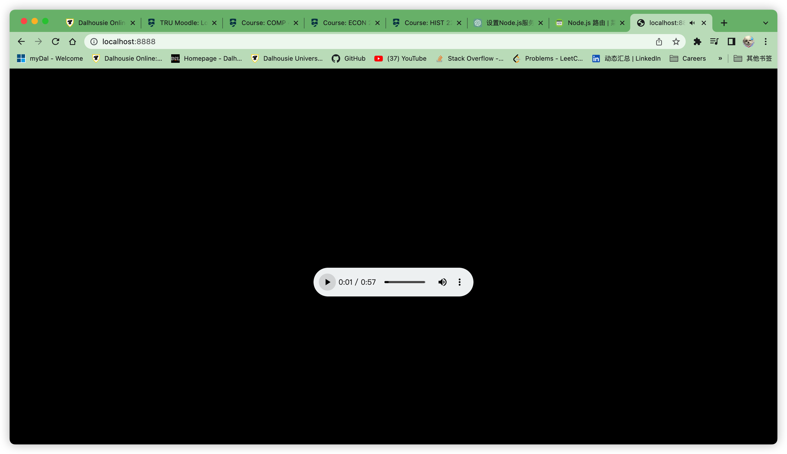

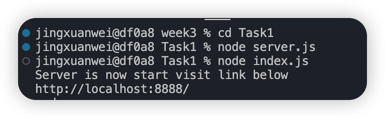


## Task2

在上面的文件服务器基础上，访问 http://localhost:port/play 来获取一个 MP3 文件流（注意：MP3流已经上传到上面的浏览器中）。

Axios是一种简化的HTTP请求工具

在当今的JavaScript Web开发社区中，无论是前端还是后端，绝大部分的HTTP请求都是直接使用HTTP库发送的，但是使用开源的Axios库可以提供更安全和更快速的HTTP请求体验。

参考链接：http://nodejs.cn/learn/make-an-http-post-request-using-nodejs

### 代码

#### server2.js

```js
// 导入需要的模块http和axios
const http = require("http");
const axios = require('axios');

// 启动函数
function start() {
  function onRequest(request, response) {
    // 如果请求的是 /play，从 Task1 服务器获取 MP3 文件流
    if (request.url === '/play') {
      //Task1 中的url地址
      const url = 'http://localhost:8888/'; 

      //发生axios请求
      axios({
        method: 'get',
        url: url,
        // 流
        responseType: 'stream'
      })
      .then(function (responseAxios) {
        response.setHeader('Content-Type', 'audio/mpeg');
        responseAxios.data.pipe(response);
      })
      .catch(function (error) {
        console.error(error);
        response.writeHead(500, { "Content-Type": "text/plain" });
        response.end("Internal Server Error");
      });

    } else {
      response.writeHead(404);
      response.end();
    }
  }

  // 创建服务器，在8889端口，因为8888端口在Task1中占用
  http.createServer(onRequest).listen(8889);
  console.log("use /play to play mp3");
  console.log("http://localhost:8889/play");
}

exports.start = start;

```

### 效果

index.js代码跟Task1没有区别

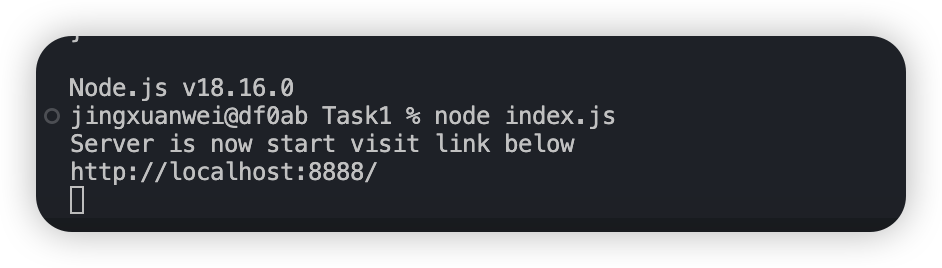

运行Task1 服务器

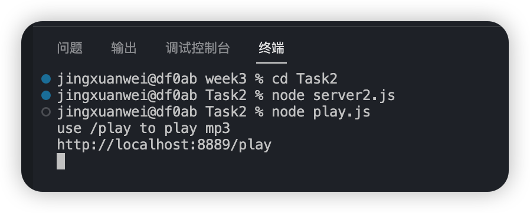

运行Task2服务器

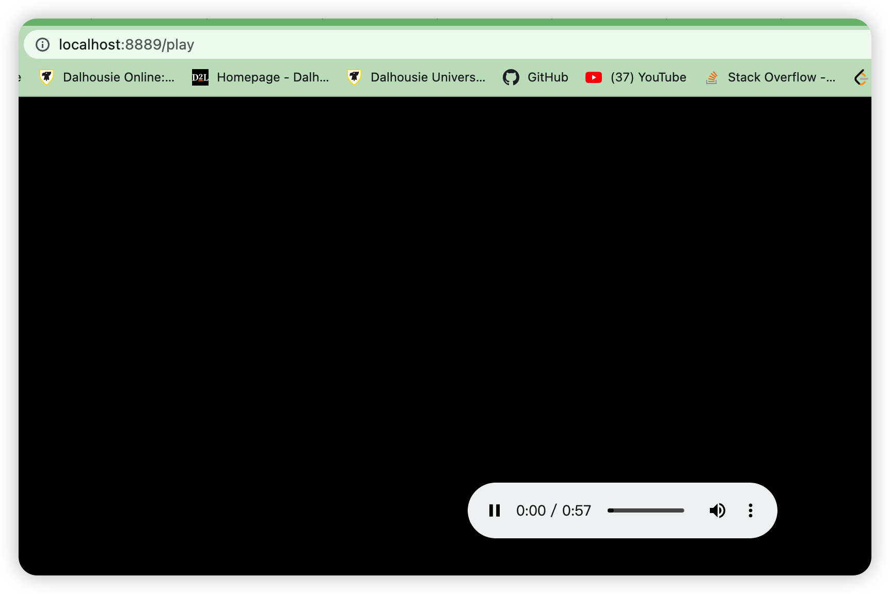

现在使用了Axios，读取了Task1中服务器的地址，并且在play端口成功播放

## Task 3

在这个项目中，你需要构建一个简单的前端界面来方便交互。第一步是在前端HTML中构建一个最简登录表单，要求输入账号、密码，并且有一个"记住我的电脑"的复选框。同时，你需要有一个注册页面，也需要输入账号和密码，并再次确认密码。在提交时，以下表单内容需要通过Axios的post方法提交到127.0.0.1：

```js
{

"user": "",

"secret": "", 

"remember": true or false

}
```

其中，secret使用自定义密钥进行AES-128-ECB加密生成密文。鉴于服务器端的响应是后续的事情，上述JSON可以先通过console.log在浏览器中打印出来。

### 代码

#### login.html

```html
<!DOCTYPE html>
<html>
<head>
    <meta charset="utf-8">
    <title>Login</title>
    <script src="https://cdn.jsdelivr.net/npm/axios/dist/axios.min.js"></script>
    <script src="https://cdnjs.cloudflare.com/ajax/libs/crypto-js/3.1.9-1/crypto-js.min.js"></script>
    <script src="encrypt.js"></script>
</head>
<body>
    <form id="login-form">
        <label for="login-username">账号:</label><br>
        <input type="text" id="login-username" name="login-username"><br>
        <label for="login-password">密码:</label><br>
        <input type="password" id="login-password" name="login-password"><br>
        <input type="checkbox" id="remember-me" name="remember-me">
        <label for="remember-me">记住我</label><br>
        <input type="button" value="提交" onclick="submitLoginForm()">
        <!-- 跳转到注册页面 -->
        <input type="button" value="注册" onclick="window.location.href='register.html'">
    </form>
</body>
</html>

```

#### register.html

```html
<!DOCTYPE html>
<html>
<head>
    <meta charset="utf-8">
    <title>Register</title>
    <script src="https://cdn.jsdelivr.net/npm/axios/dist/axios.min.js"></script>
    <script src="https://cdnjs.cloudflare.com/ajax/libs/crypto-js/3.1.9-1/crypto-js.min.js"></script>
    <script src="encrypt.js"></script>
</head>
<body>
    <form id="register-form">
        <label for="register-username">账号:</label><br>
        <input type="text" id="register-username" name="register-username"><br>
        <label for="register-password">密码:</label><br>
        <input type="password" id="register-password" name="register-password"><br>
        <label for="confirm-password">确认密码:</label><br>
        <input type="password" id="confirm-password" name="confirm-password"><br>
        <input type="button" value="提交" onclick="submitRegisterForm()">
    </form>
</body>
</html>

```

Encrypt.js

```js
// 自定义随机生成的密钥
var SECRET_KEY = "j9l8k7a6t5c4g3t2";

// AES-128-ECB加密方法
function encrypt(text) {
    return CryptoJS.AES.encrypt(text, SECRET_KEY, {
        mode: CryptoJS.mode.ECB
    }).toString();
}

function submitLoginForm() {
    var username = document.getElementById("login-username").value;
    var password = document.getElementById("login-password").value;
    var remember = document.getElementById("remember-me").checked;

    var encryptedPassword = encrypt(password);

  	// 需要的格式
    var formData = {
        "user": username,
        "secret": encryptedPassword,
        "remember": remember
    };

  	// 在浏览器的控制台输出
    console.log(formData);
  	// 使用axios 发送登陆请求到服务器的3000端口，数据是formData
    axios.post('http://127.0.0.1:3000', formData);
}

function submitRegisterForm() {
    var username = document.getElementById("register-username").value;
    var password = document.getElementById("register-password").value;
    var confirmPassword = document.getElementById("confirm-password").value;

    if (password !== confirmPassword) {
        alert("两次输入的密码不一致，请重新输入！");
        return;
    }

  	// 用加密算法加密密码
    var encryptedPassword = encrypt(password);

    var formData = {
        "user": username,
        "secret": encryptedPassword,
        "remember": false
    };

    console.log(formData);
 	  // 使用axios 发送注册请求到服务器的3000端口，数据是formData
    axios.post('http://127.0.0.1：3000', formData);
}

```

#### Server3.js

```js
// 使用express 建立服务器
const express = require('express');
const bodyParser = require('body-parser');
// 使用cors 解决跨域问题
const cors = require('cors');

const app = express();
app.use(cors());
app.use(bodyParser.json());

app.post('/', (req, res) => {
  	// 在控制台输出
    console.log(req.body);
   	// 返回状态
    res.status(200).send('Received POST request');
});

app.listen(3000, () => {
  	// 当服务器成功运行的时候输出
    console.log('Server is running on port 3000');
});

```

### 效果

#### 使用浏览器自带console

##### Login

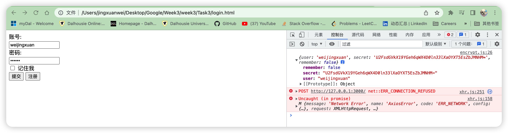

##### Register

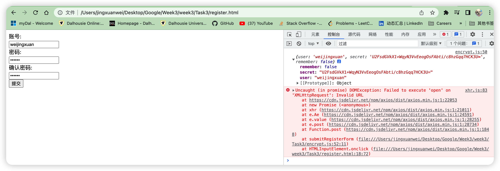

###### 密码不一致

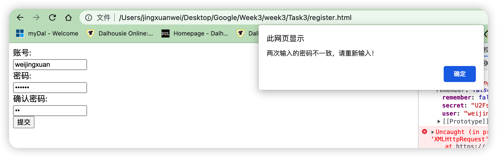

#### 使用axios请求到server3

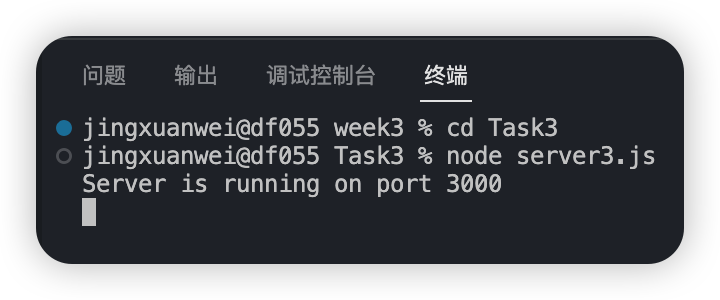

##### Login

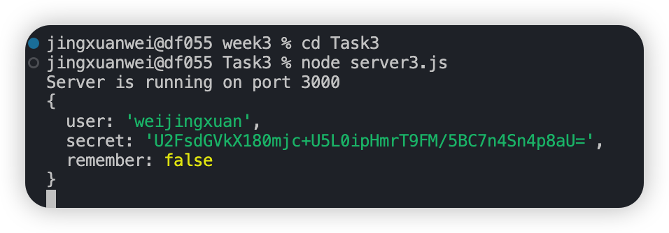

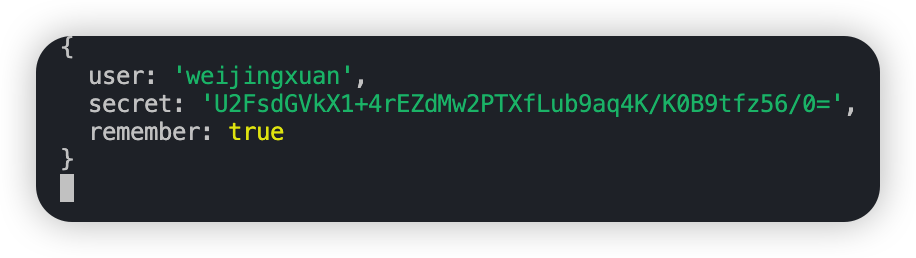

##### Register

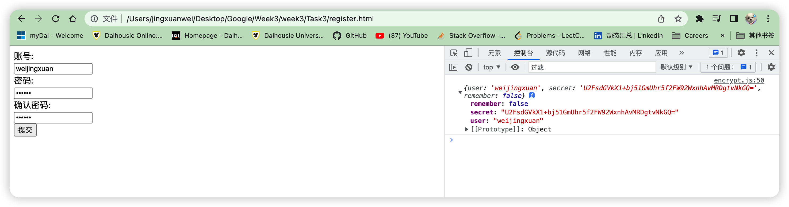

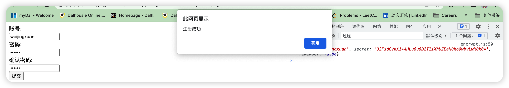

## Task 4

https://developer.musixmatch.com/

从MusiXMatch获得免费许可后，使用Axios发送请求，根据Artist、Title、Album获取歌词的文本信息。

### 代码

```js
const axios = require('axios');

// MusiXMatch API key
const API_KEY = '9b9544a156347646e89e66811bf50797';

// 根据艺术家、标题和专辑获取歌词
async function getLyrics(artist, title, album) {
  try {
    const response = await axios.get('https://api.musixmatch.com/ws/1.1/matcher.lyrics.get', {
      params: {
        format: 'json',
        callback: 'callback',
        q_track: title,
        q_artist: artist,
        q_album: album,
        apikey: API_KEY
      }
    });

    if (response.data.message.body.lyrics) {
      return response.data.message.body.lyrics.lyrics_body;
    } else {
      return 'Lyrics not found';
    }
  } catch (error) {
    console.error('Error fetching lyrics:', error);
    return 'Error fetching lyrics';
  }
}

getLyrics('周杰伦', '七里香', 'album').then((lyrics) => console.log(lyrics));

```

### 效果

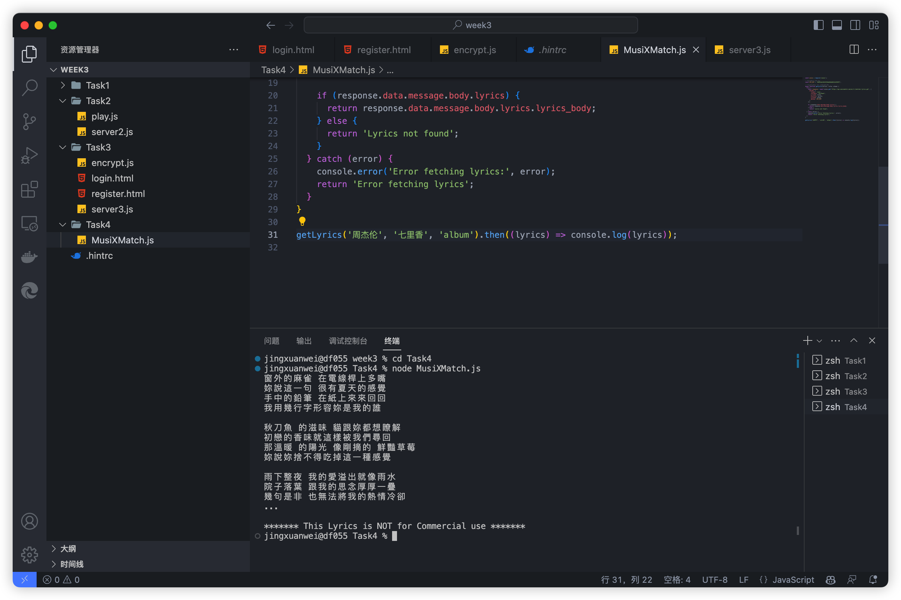