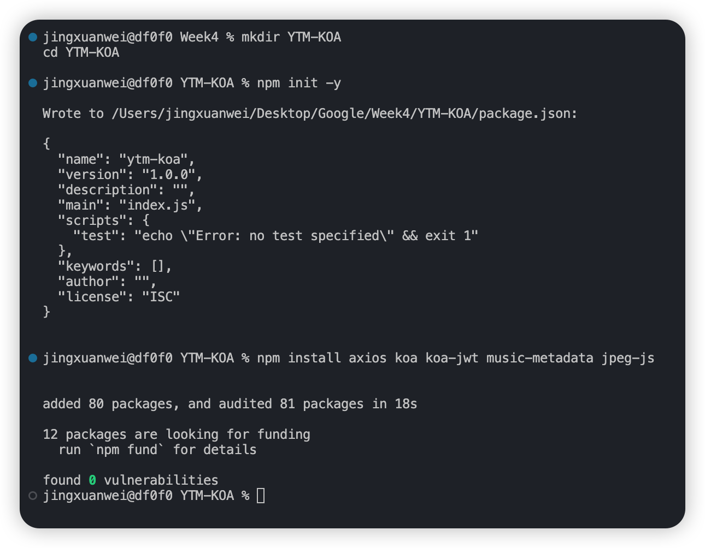
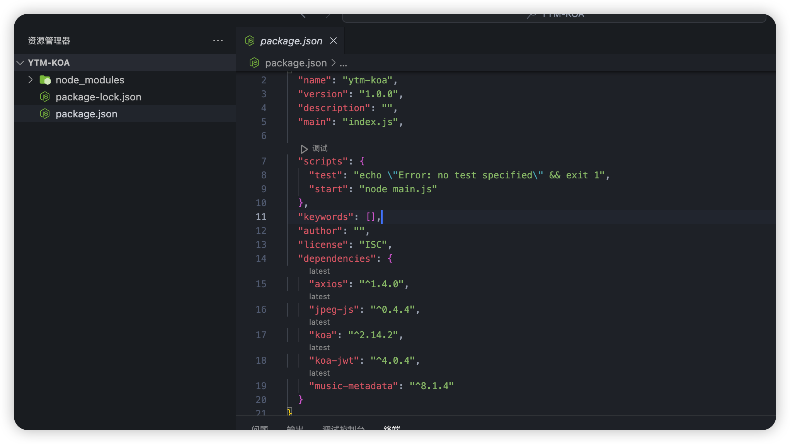
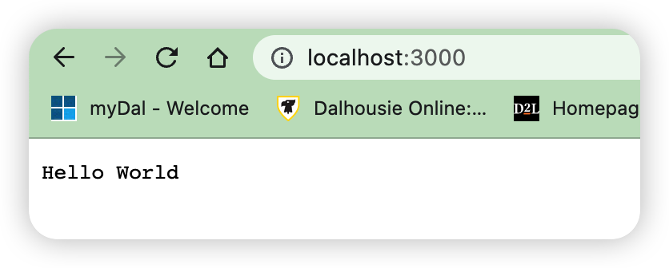

##### YTM项目第4周上线

本周的任务是了解Mangodb数据库，同学完成之后可以自己去学习下Koa框架。

### NPM项目构建

我们学习了NPM的基本用法，即安装和介绍。在一些大型项目中，例如Vue和其他开源前端模板，我们只需要执行两行命令：

```bash
git clone xxx

npm i
```

就可以快速安装和构建项目所需的依赖，并可以使用`npm run dev`等命令直接启动项目。

例如，使用`npm run dev`命令直接启动项目，这是如何实现的？

构建Node项目依赖于一个名为package.json的文件，npm执行的大部分任务与该文件有关。

#### 描述 the-package-json-guide

`package-lock.json` 是在 npm 修改 `node_modules` 目录或 `package.json` 文件时自动生成的。它描述了生成的确切依赖树，使得后续的安装能够生成完全相同的依赖树，无论中间依赖的更新情况如何。

该文件的目的是将其提交到源代码库中，它有以下几个作用：

- 描述一种依赖树的唯一表示，以确保团队成员、部署和持续集成能够安装完全相同的依赖项。
- 提供一种功能，让用户可以在不提交整个 `node_modules` 目录的情况下“时光旅行”到先前的状态。
- 通过可读的源代码差异提高对依赖树更改的可见性。
- 通过允许 npm 跳过对先前安装的软件包重复解析元数据来优化安装过程。
- 自 npm v7 起，锁定文件包含足够的信息以获取完整的依赖树图，减少了读取 `package.json` 文件的需要，并实现了显著的性能改进。

##### `package-lock.json` vs `npm-shrinkwrap.json`

这两个文件具有相同的格式，并在项目的根目录中执行类似的功能。

区别在于 `package-lock.json` 不能被发布，如果在根目录以外的任何位置发现它，将被忽略。

相反，[npm-shrinkwrap.json](https://chat.openai.com/configuring-npm/npm-shrinkwrap-json) 允许发布，并从遇到的位置开始定义依赖树。除非部署 CLI 工具或以其他方式使用发布流程生成生产包，否则不建议使用它。

如果在项目的根目录中同时存在 `package-lock.json` 和 `npm-shrinkwrap.json`，`npm-shrinkwrap.json` 将优先，`package-lock.json` 将被忽略。

##### 隐藏的锁定文件

为了避免重复处理 `node_modules` 文件夹，npm 从 v7 版开始使用位于 `node_modules/.package-lock.json` 中的“隐藏”锁定文件。它包含有关依赖树的信息，并在读取整个 `node_modules` 层次结构之前使用它，前提是满足以下条件：

- 所有它引用的软件包文件夹都存在于 `node_modules` 层次结构中。
- `node_modules` 层次结构中不存在任何不在锁定文件中列出的软件包文件夹。
- 文件的修改时间至少与它引用的所有软件包文件夹的修改时间相同。

也就是说，只有在它是与最近更新的软件包树的一部分创建的情况下，隐藏的锁定文件才是相关的。如果其他 CLI 在任何方面改变了树，则会检测到这一点，隐藏的锁定文件将被忽略。

请注意，可以手动更改软件包的 *内容*，而不影响软件包文件夹的修改时间。例如，如果您向 `node_modules/foo/lib/bar.js` 添加一个文件，则 `node_modules/foo` 的修改时间不会反映此更改。如果您要手动编辑 `node_modules` 中的文件，通常最好删除 `node_modules/.package-lock.json` 中的文件。

由于旧的 npm 版本会忽略隐藏的锁定文件，因此它不包含“常规”锁定文件中存在的向后兼容性功能。也就是说，它的 `lockfileVersion` 是 `3`，而不是 `2`。

##### 处理旧的锁定文件

当 npm 在包安装过程中检测到来自 npm v6 或之前的锁定文件时，它会自动更新锁定文件，以从 `node_modules` 树或（在 `node_modules` 树为空或非常旧的锁定文件格式的情况下）npm 注册表中获取缺失的信息。

##### 文件格式

###### `name`

这是该包的名称，与 `package.json` 中的名称相匹配。

###### `version`

这是该包的版本，与 `package.json` 中的版本相匹配。

###### `lockfileVersion`

一个整数版本，从 `1` 开始，表示生成此 `package-lock.json` 文件所使用的文档版本的语义。

请注意，文件格式在 npm v7 中发生了重大变化，以跟踪否则需要查看 `node_modules` 或 npm 注册表的信息。npm v7 生成的锁定文件将包含 `lockfileVersion: 2`。

- 没有提供版本：早于 npm v5 的版本的“古老”缩减包文件。
- `1`：npm v5 和 v6 使用的锁定文件版本。
- `2`：npm v7 和 v8 使用的锁定文件版本。向后兼容到 v1 锁定文件。
- `3`：npm v9 使用的锁定文件版本。向后兼容到 npm v7。

npm 将始终尝试从锁定文件中获取任何可用的数据，即使它不是设计用于支持的版本。

###### `packages`

这是一个将软件包位置映射到包含该软件包信息的对象。

通常，根项目使用 `""` 作为键，所有其他软件包使用相对于根项目文件夹的路径作为键。

软件包描述符具有以下字段：

- version：在 `package.json` 中找到的版本。
- resolved：实际解析软件包的位置。对于从注册表获取的软件包，这将是一个指向 tarball 的 URL。对于 git 依赖项，这将是包含提交 SHA 的完整 git URL。对于链接依赖项，这将是链接目标的位置。`registry.npmjs.org` 是一个特殊的值，表示“当前配置的注册表”。
- integrity：用于在此位置解压缩的软件包的 `sha512` 或 `sha1` [标准子资源完整性](https://w3c.github.io/webappsec/specs/subresourceintegrity/)字符串。
- link：一个标志，表示这是一个符号链接。如果存在此标志，则不指定其他字段，因为链接目标也将包含在锁定文件中。
- dev、optional、devOptional：如果该软件包严格属于 `devDependencies` 树，则 `dev` 为 true。如果它严格属于 `optionalDependencies` 树，则 `optional` 为 true。如果它既是 `dev` 依赖项又是非 `dev` 依赖项的可选依赖项的传递依赖项，则 `devOptional` 为 true。（对于 `dev` 依赖项的 `optional` 依赖项，`dev` 和 `optional` 都为 true。）
- inBundle：一个标志，表示该软件包是捆绑依赖项。
- hasInstallScript：一个标志，表示该软件包具有 `preinstall`、`install` 或 `postinstall` 脚本。
- hasShrinkwrap：一个标志，表示该软件包具有 `npm-shrinkwrap.json` 文件。
- bin、license、engines、dependencies、optionalDependencies：来自 `package.json` 的字段。

###### dependencies

用于支持 npm 使用 `lockfileVersion: 1` 的旧版本的数据。这是一个将软件包名称映射到依赖对象的映射。由于对象结构严格是分层的，因此在某些情况下，表示符号链接依赖关系可能有一定的挑战性。

如果存在 `packages` 部分，npm v7 将完全忽略此部分，但会保持其最新状态，以支持在 npm v6 和 npm v7 之间切换。

依赖对象具有以下字段：

- version：一个依赖包的规范，根据软件包的性质而变化，并且可用于获取它的新副本。
  - 捆绑依赖项：无论来源如何，都是纯粹用于信息目的的版本号。
  - 注册表源：这是一个版本号（例如 `1.2.3`）。
  - git 源：这是带有已解决提交的 git 规范（例如 `git+https://example.com/foo/bar#115311855adb0789a0466714ed48a1499ffea97e`）。
  - HTTP tarball 源：这是 tarball 的 URL（例如 `https://example.com/example-1.3.0.tgz`）。
  - 本地 tarball 源：这是 tarball 的文件 URL（例如 `file:///opt/storage/example-1.3.0.tgz`）。
  - 本地链接源：这是链接的文件 URL（例如 `file:libs/our-module`）。
- integrity：解压缩在此位置的软件包的 `sha512` 或 `sha1` [标准子资源完整性](https://w3c.github.io/webappsec/specs/subresourceintegrity/)字符串。对于 git 依赖项，这是提交 SHA。
- resolved：对于注册表源，这是 tarball 相对于注册表 URL 的路径。如果 tarball URL 不在与注册表 URL 相同的服务器上，则这是一个完整的 URL。`registry.npmjs.org` 是一个特殊的值，表示“当前配置的注册表”。
- bundled：如果为 true，则表示这是捆绑依赖项，并且将由父模块安装。在安装过程中，将在提取阶段从父模块中提取此模块，而不是作为单独的依赖项安装。
- dev：如果为 true，则该依赖项仅是顶级模块的开发依赖项，或者是一个非开发依赖项的传递依赖项。对于既是 `dev` 依赖项又是非开发依赖项的传递依赖项，此值为 false。（`optional` 依赖项的 `dev` 依赖项将同时设置 `dev` 和 `optional`。）
- optional：如果为 true，则该依赖项仅是顶级模块的可选依赖项，或者是一个非可选依赖项的传递依赖项。对于既是 `optional` 依赖项又是非可选依赖项的传递依赖项，此值为 false。
- requires：这是一个模块名称到版本的映射。这是我们无论将在哪里安装，都要求与之匹配的依赖关系的列表。版本应与我们的 `dependencies` 或高于我们的级别中的依赖关系通过正常匹配规则匹配。
- dependencies：该依赖项的依赖关系，与顶级相同。

##### 参见

- [npm shrinkwrap](https://chat.openai.com/commands/npm-shrinkwrap)
- [npm-shrinkwrap.json](https://chat.openai.com/configuring-npm/npm-shrinkwrap-json)
- [package.json](https://chat.openai.com/configuring-npm/package-json)
- [npm install](https://chat.openai.com/commands/npm-install)

#### http://nodejs.cn/learn/the-package-lock-json-file


## 任务开始

创建一个名为YTM-KOA的项目，并临时引入axios、koa、koa-jwt、music-metadata、jpeg-js依赖，然后使用npm start命令运行脚本：

```bash
node main.js
```

在ytm-koa文件夹中，创建一个新文件main.js，并编写以下内容：

```js
const Koa = require('koa');

const app = new Koa();

app.use(async ctx => { 
  ctx.body = 'Hello World';
});

app.listen(3000);
```

运行以下代码：

```bash
npm i

npm start
```

项目成功启动，访问localhost:3000即可看到Hello World。







### 本地模拟环境搭建

由于实习环境无法提供数据库，我们以本地方式模拟mongoDB数据库，mongo的基本格式实际上是Json。

要求实现一个`libraryInit(path)`方法，该函数在APP启动时读取/Library下的所有音频文件（用户需要提前放置一些MP3文件，大约100个），通过music-metadata库获取文件的标签信息，并生成index.json文件存储在/Library中，格式如下： 

```js
{
  "track_id": "",
  "title": "",
  "artist": ["", ""],
  "album": "",
  "album_id": "",
  "genre": "",
  "copyright": "",
  "length" : "",
  "track_number": 0,
  "quality": "STD",
  "file": "file path"
}
```

其中，track_id的生成采用连接artist、title和album三个字符串并使用MD5加密取前16个字符的方法。track_id是音乐库中曲目的唯一索引值，因此不同的歌曲不能重复。（即在数据库中，track_id并不是严格唯一的，后期同一首歌会有多个不同音质的文件对应）

关于信息对应的标签键的更多信息，请参考https://www.npmjs.com/package/music-metadata。

另外，如果有专辑封面图像，则将标签中的imageBuffer存储在/Library/cover/<album_id>.jpg中。注意：有时imageBuffer是PNG格式，因此需要使用jpeg-js库进行编码和保存，质量设置为100。

该JSON文件是顺序存储的，采用单行结构，即每行为上述对象的一部分。

每个文件的数据库创建应该是异步并行的，使用各种方法在有限数量内控制并行线程。具体的软件行为是，在通过walk等方法构建MP3文件列表之后，在n个线程的线程池中对列表中的每个文件执行类似于indexCreate(filePath)的异步方法。该函数负责读取文件的id3Tag，获取上述信息，编写JSON变量，将imageBuffer转储到文件中，然后阻止写入/Library/index.json（即如果index.json正在被其他线程使用，该函数应该等待，直到它可以访问该文件）。在创建每个文件后，在控制台中记录以下结构：

```bash
Index Created: <track_id> <file>
```

线程池中的线程数n应该通过使用os模块获取有关CPU的信息来确定。同时编写一个`libraryLoad(filePath)`方法，直接读取index.json并将其加载到内存中，返回对象。编写一个`libraryUpdate(lib, filePath)`方法来更新index.json文件，其中包含：

1. 比较并添加未索引的MP3文件
2. 删除在本地搜索中找不到对应文件的条目

注：这个库是针对用户的索引，以track_id为唯一标识。然而，在文件级别上，文件路径是唯一的索引值。上述函数名称是自定义的。

`libraryLoad(filePath)`和`libraryUpdate(path)`应该占用文件直到运行过程结束，然后释放控制。所以现在逻辑非常清晰：在'npm start'启动项目后，首先尝试'libraryLoad(filePath)'，如果文件不存在，则运行'libraryInit(path)'。如果文件存在，则挂载`.then((lib) => { libraryUpdate(lib, filePath) })`来完成索引库的加载和刷新。

### "云端"上的数据

在这个项目中，我们使用非关系型数据库mongoDB构建整个系统的数据库系统。

mongo的基本概念和介绍：

https://www.runoob.com/mongodb/mongodb-intro.html

在Node中，我们使用mongoose库处理Node与MongoDB的交互。实际上，Node本身集成了对MongoDB.js的原生支持，但是mongoose中间件更容易使用。Mongoose中文手册：

http://mongoosejs.net/docs/index.html

在本地安装MongoDB库之后，我们需要4个数据库：users、library、playlists、history，用于后续项目。

其中，library的数据结构之前已经指出，总集合命名为index，用户的私人库集合命名为u_<uid>，结构如下：

```js
{
  "type": "track / album / playlist",
  "id": "id",
  "added_date": 
}
```

users的数据结构如下，不需要管理集合：

```js
{
  "uid": "",
  "name": "",
  "secret": "",
  "subscribe": "Premium",
  "subscribe_expired": ,
  "last_login": ,
  "playing": "machine_id"
}
```

playlists分为总索引集合和单个列表集合，结构如下：

总索引集合命名为index：

```js
{
  "pid": "id",
  "author": "uid",
  "name": "",
  "description": "",
  "added": 0,
  "liked": 0,
  "shared": 0,
  "played": 0,
  "public": true,
  "image": "path",
  "type": "playlist / album",
  "last_update": 
}
```

单个列表集合为<pid>：

```js
{
  "tid": "track_id",
  "order": 0 // order
}
```

同时，将之前在前一节中构建的library中与文件处理相关的所有函数替换为使用Mongoose与Mongose数据库操作的方式，并将index.json迁移到MongoDB，但保留cover中的内容，仍以本地文件路径索引的形式存储。

在将数据写入MongoDB等数据库时，可以忽略阻塞问题，中间件和数据库引擎将自行处理并发问题。

