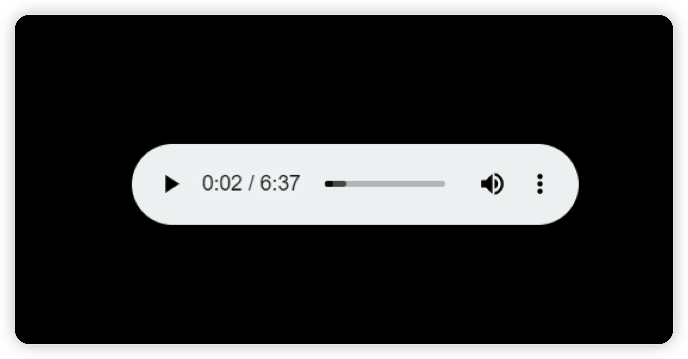
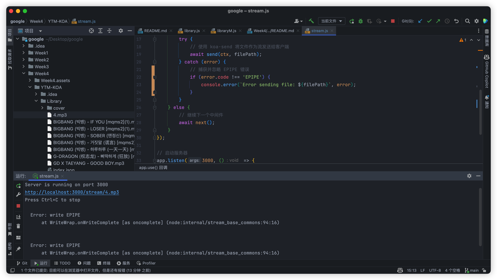
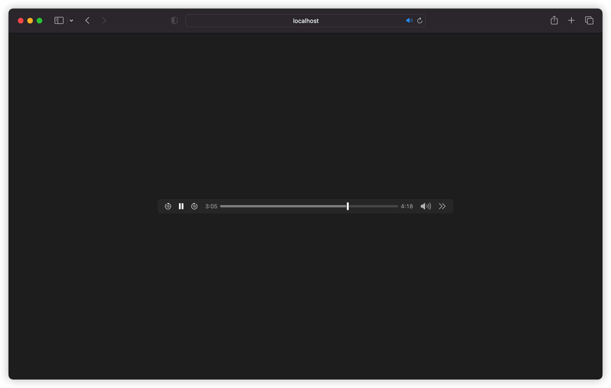

## Week 5：集成KOA后端框架

在很长一段时间里，基于Node.js的后端开发都是基于Express这个框架上的。Express是在Node原生的HTTP进行 再封装库。

### koa1

随着新版Node.js开始支持ES6，Express的团队又基于ES6的generator重新编写了下一代web框架koa。和 Express相比，koa 1.0使用generator实现异步，代码看起来像同步的：

```js
var koa = require('koa');

var app = koa();

app.use('/test', function *() { 
  yield doReadFile1(); 
  var data = yield doReadFile2(); 
  this.body = data; 
});

app.listen(3000);
```

用generator实现异步比回调简单了不少，但是generator的本意并不是异步。Promise才是为异步设计的，但是 Promise的写法……想想就复杂。为了简化异步代码，ES7（目前是草案，还没有发布）引入了新的关键字async和 await，可以轻松地把一个function变为异步模式：

```js
async function () {

var data = await fs.read('/file1');

}
```

这是JavaScript未来标准的异步代码，非常简洁，并且易于使用。

### koa2

koa团队并没有止步于koa 1.0，他们非常超前地基于ES7开发了koa2，和koa 1相比，koa2完全使用Promise并配 合async来实现异步。

koa2的代码看上去像这样：

```js
app.use(async (ctx, next) => { 
  await next(); 
  var data = await doReadFile(); 
  ctx.response.type = 'text/plain'; 
  ctx.response.body = data; 
});
```

出于兼容性考虑，目前koa2仍支持generator的写法，但下一个版本将会去掉。

目前JavaScript处于高速进化中，ES7是大势所趋。为了紧跟时代潮流，我们将使用最新的koa2开发。

关于KOA2的官方文档和指南：https://github.com/demopark/koa-docs-Zh-CN 

KOA2官方示范案例： https://github.com/koajs/kick-off-koa

在开始任务之前，可以先通过kick-off-koa去了解最基础的中间件构建、HTTP请求响应流程。

KOA 的中文手册《Koa2 进阶学习笔记》：https://github.com/chenshenhai/koa2-note 

KOA的原理探究《Koa.js设计模式》：https://chenshenhai.github.io/koajs-design-note/

### 任务1

#### 参考：

https://juejin.cn/post/6844904007958265864

当你使用手机畅快的看着视频、听着音乐，这时，你有想过这些东西是怎么传输到你的手机上的么？

这次，就让我们以`nodejs`的`koa2`为例，来一个大揭秘！

我们以mp3类型的音频为例子： 下图就是一个http请求mp3文件，


1. 在`Request Headers`中有个[Range: bytes=0-](https://link.juejin.cn?target=https%3A%2F%2Fdeveloper.mozilla.org%2Fzh-CN%2Fdocs%2FWeb%2FHTTP%2FHeaders%2FRange),`Range`代表指示服务器应该返回文件的哪一或哪几部分。end是一个整数（如：`Range: bytes=0-136868`），表示在特定单位下，范围的结束值。这个值是可选的，如果不存在，表示此范围一直延伸到文档结束。
2. 假如在响应中存在 `Accept-Ranges` 首部（并且它的值不为 `“none”`），那么表示该服务器支持范围请求。 `Accept-Ranges: bytes` 表示界定范围的单位是 `bytes` 。这里  `Content-Length`它提供了要检索的文件的完整大小。
3. 在`Response Headers`中的，`Content-Length` 首部现在用来表示先前请求范围的大小（而不是整个文件的大小）。`Content-Range` 响应首部则表示这一部分内容在整个资源中所处的位置。 对于以上的解释可以参考：[HTTP请求范围](https://link.juejin.cn?target=https%3A%2F%2Fdeveloper.mozilla.org%2Fzh-CN%2Fdocs%2FWeb%2FHTTP%2FRange_requests),`HTTP` 协议范围请求允许服务器只发送 `HTTP` 消息的一部分到客户端。范围请求在传送大的媒体文件，或者与文件下载的断点续传功能搭配使用时非常有用。

##### 1. 了解完基础知识，就到了`nodejs`登场的时候。

首先介绍两个我们最常用的两个模块[fs【文件系统】](https://link.juejin.cn?target=http%3A%2F%2Fnodejs.cn%2Fapi%2Ffs.html%23fs_file_system)和[path【模块提供用于处理文件路径和目录路径的实用工具】 ](https://link.juejin.cn?target=http%3A%2F%2Fnodejs.cn%2Fapi%2Fpath.html%23path_path),我们以`koa`为例进行介绍

引用的写法如下：

```isbl
isbl
复制代码const fs = require('fs')
const path = require('path')
```

##### 2.音视频文件的类型

从上图中可以看出，在`Response Headers`中`Content-Type: audio/mpeg`,而常用的音视频格式有`mp3、mp4、webm、ogg、ogv、flv、wav`等，在`HTTP`中返回的`Content-Type`各不相同，整理如下：

```sml
sml
复制代码const mime = {
    'mp4': 'video/mp4',
    'webm': 'video/webm',
    'ogg': 'application/ogg',
    'ogv': 'video/ogg',
    'mpg': 'video/mepg',
    'flv': 'flv-application/octet-stream',
    'mp3': 'audio/mpeg',
    'wav': 'audio/x-wav'
}
```

##### 3.判断请求文件类型

每次在客户端进行访问的时候，我们首先需要确定请求文件的类型，因此，我们还需要如下的一个纯函数：

```moonscript
moonscript
复制代码let getContentType = (type) => {
    if (mine[type]) {
        return mine[type]
    } else {
        reutrn null
    }
}
```

##### 4.读取文件

有了上面的准备我们就可以开始读取相应的文件，并返回给客户端了。

```javascript
javascript
复制代码let readFile = async(ctx, options) => {
    // 我们先确认客户端请求的文件的长度范围
    let match = ctx.request.header['range']
    // 获取文件的后缀名
    let ext = path.extname(ctx.path).toLocaleLowerCase()
    // 获取文件在磁盘上的路径
    let diskPath = decodeURI(path.resolve(options.root + ctx.path))
    // 获取文件的开始位置和结束位置
    let bytes = match.split('=')[1]
    // 有了文件路径之后，我们就可以来读取文件啦
    let stats = fs.statSync(diskPath)
    // 在返回文件之前，我们还要知道获取文件的范围（获取读取文件的开始位置和开始位置）
    let start = Number.parseInt(bytes.split('-')[0]) // 开始位置
    let end   = Number.parseInt(bytes.split('-')[1]) || (stats.size - 1) // 结束位置
    // 如果是文件类型
    if (stats.isFile()) {
        reture new Promise((resolve, reject) => {
            // 读取所需要的文件
            let stream = fs.createReadStream(diskPath, {start: start, end: end})
            // 监听 ‘close’当读取完成时，将stream销毁
            ctx.res.on('close', function () {
                stream.distory()
            })
            // 设置 Response Headers
            ctx.set('Content-Range': `bytes ${start}-${end}/${stats.size}`)
            ctx.set('Accept-Range', `bytes`)
            // 返回状态码
            ctx.status = 206
            // getContentType上场了，设置返回的Content-Type
            ctx.type = getContentType(ext.replace('.','')
            stream.on('open', function(length) {
                if (ctx.res.socket.writeable) {
                    try {
                        stream.pipe(ctx.res)
                    } catch (e) {
                        stream.destroy()
                    }
                } else {
                    stream.destroy()
                }
            })
            stream.on('error', function(err) {
                 if (ctx.res.socket.writable) {
                    try {
                        ctx.body = err
                    } catch (e) {
                        stream.destroy()
                    }
                }
                reject()
            })
            // 传输完成
            stream.on('end', function () {
                resolve()
            })
        })
    }
}
```

##### 5.导出文件

此时我们还需要将方法导出去，方便使用

```javascript
javascript
复制代码module.exports = function (opts) {
    // 设置默认值
    let options = Object.assign({}, {
        extMatch: ['.mp4', '.flv', '.webm', '.ogv', '.mpg', '.wav', '.ogg'],
        root: process.cwd()
    }, opts)
    
    return async (ctx, next) => {
        // 获取文件的后缀名
        let ext = path.extname(ctx.path).toLocaleLowerCase()
        // 判断用户传入的extMath是否为数组类型，且访问的文件是否在此数组之中
        let isMatchArr = options.extMatch instanceof Array && options.extMatch.indexOf(ext) > -1
        // 判断用户传输的extMath是否为正则类型，且请求的文件路径包含相应的关键字
        let isMatchReg = options.extMatch instanceof RegExp && options.extMatch.test(ctx.path)
        if (isMatchArr || isMatchReg) {
            if (ctx.request.header && ctx.request.header['range']) {
                // readFile 上场
                return await readFile(ctx, options)
            }
        }
        await next()
    }
}
```

##### 6.在app.js中使用

终于来到了我们在项目中使用的关键时刻

```stylus
stylus
复制代码const Koa = require('koa')
const app = new Koa()
app.use(koaMedia({
  extMatch: /\.mp[3-4]$/i
}))
```

这样我们就完成了从客户端请求到服务端返回的全部过程。

关于**中间件原理**可以看我的这篇文章[nodejs中koa2中间件原理分析](https://juejin.cn/post/6844903929373786119)

**注：使用到的API**

###### 1. [Content-Range](https://link.juejin.cn?target=https%3A%2F%2Fdeveloper.mozilla.org%2Fzh-CN%2Fdocs%2FWeb%2FHTTP%2FHeaders%2FContent-Range)

```
Content-Range: <unit> <range-start>-<range-end>/<size>
```

1. `<unit>` 数据区间所采用的单位。通常是字节（byte）。
2. `<range-start>` 一个整数，表示在给定单位下，区间的起始值。
3. `<range-end>` 一个整数，表示在给定单位下，区间的结束值。
4. `<size>` 整个文件的大小（如果大小未知则用"*"表示）。

###### 2. [fs.stat](https://link.juejin.cn?target=http%3A%2F%2Fnodejs.cn%2Fapi%2Ffs.html%23fs_fs_stat_path_options_callback)

`fs.stat`用于检查文件是否存在，读取文件状态。**获取文件信息**。

| 方法                      | 描述                                                         |
| ------------------------- | ------------------------------------------------------------ |
| stats.isFile()            | 如果是文件返回 true，否则返回 false。                        |
| stats.isDirectory()       | 如果是目录返回 true，否则返回 false。                        |
| stats.isBlockDevice()     | 如果是块设备返回 true，否则返回 false。                      |
| stats.isCharacterDevice() | 如果是字符设备返回 true，否则返回 false。                    |
| stats.isSymbolicLink()    | 如果是软链接返回 true，否则返回 false。                      |
| stats.isFIFO()            | 如果是FIFO，返回true，否则返回 false。FIFO是UNIX中的一种特殊类型的命令管道。 |
| stats.isSocket()          | 如果是 Socket 返回 true，否则返回 false。                    |

参考文档：[Node.js 文件系统](https://link.juejin.cn?target=https%3A%2F%2Fwww.runoob.com%2Fnodejs%2Fnodejs-fs.html)

###### 3. [fs.statSync](https://link.juejin.cn?target=http%3A%2F%2Fnodejs.cn%2Fapi%2Ffs.html%23fs_fs_statsync_path_options)

`fs.statSync`同步的stat，返回stats类

###### 4. [stats.isFile()](https://link.juejin.cn?target=http%3A%2F%2Fnodejs.cn%2Fapi%2Ffs%2Fstats_isfile.html)

```
stats.isFile()`判断获取的对象是否为常规文件，是则返回`true
```

###### 5. [stats.size](https://link.juejin.cn?target=http%3A%2F%2Fnodejs.cn%2Fapi%2Ffs.html%23fs_stats_size)

`stats.size`获取文件大小（以字节为单位）

###### 6. [path.extname](https://link.juejin.cn?target=http%3A%2F%2Fnodejs.cn%2Fapi%2Fpath.html%23path_path_extname_path)

`path.extname`方法返回 `path` 的扩展名，从最后一次出现 .（句点）字符到 `path`最后一部分的字符串结束。 如果在 `path` 的最后一部分中没有 . ，或者如果 `path` 的基本名称（参阅 `path.basename()`）除了第一个字符以外没有 .，则返回空字符串。

###### 7. [fs.createReadStream](https://link.juejin.cn?target=http%3A%2F%2Fnodejs.cn%2Fapi%2Ffs.html%23fs_fs_createreadstream_path_options)

`fs.createReadStream`，参数`option`可以包括 `start` 和 `end` 值，以从文件中读取一定范围的字节而不是整个文件。start 和 end 都包含在内并从 0 开始计数，允许的值在 [0, Number.MAX_SAFE_INTEGER] 的范围内。如果指定了 fd 并且省略 start 或为 undefined，则 fs.createReadStream() 从当前的文件位置开始顺序地读取。 encoding 可以是 Buffer 接受的任何一种字符编码。


用KOA2实现通过get URL获取对应音频串流的的模块，例如： http://localhost/stream/ 返回音频串流。







```js
const Koa = require('koa');
const send = require('koa-send');
const {join} = require("path");
const app = new Koa();

// 定义音频文件的存储路径
const audioFilePath = './Library';

// 处理音频文件请求
app.use(async (ctx, next) => {
    // 检查请求是否以 /stream/ 开头
    if (ctx.path.startsWith('/stream/')) {
        // 获取音频文件名
        const filename = ctx.path.slice('/stream/'.length);
        const filePath = `${audioFilePath}/${filename}`;

        try {
            // 使用 koa-send 将文件作为流发送给客户端
            await send(ctx, filePath);
        } catch (error) {
            // 捕获并忽略 EPIPE 错误
            if (error.code !== 'EPIPE') {
                console.error(`Error sending file: ${filePath}`, error);
            }
        }
    } else {
        // 继续下一个中间件
        await next();
    }
});

// 启动服务器
app.listen(3000, () => {
    console.log('Server is running on port 3000');
    console.log('http://localhost:3000/stream/4.mp3');
    console.log('Press Ctrl+C to stop');
});

```


### 任务2

现在，我们将开始着手处理在学习Axios的时候写的前端页面所发送的表单。 对于那个前端页面，在登陆时，发送POST请求，后端将信息与数据库中的users对比，如果正确，返回：

```js
{

"status": 0, "msg": "Success"

}
```

如果错误，返回：

```js
{

"status": 1, "msg": "Username or Password error."

} 
```

在创建用户（注册）时，发送POST请求。 如果正确，返回：

```js
{

"status": 0, "msg": "Success"

}
```

如果错误，返回：

```js
{

"status": 1, "msg": "User Already Exist." // 或其它的错误信息

}
```

### 任务3

我们始终推荐，有现成的轮子就不要自己造。 所以，尝试集成koa-stream包以代替在任务1中写的逻辑完成串流。 https://github.com/claudetech/koa-stream 不要忘记在packages.json添加该依赖