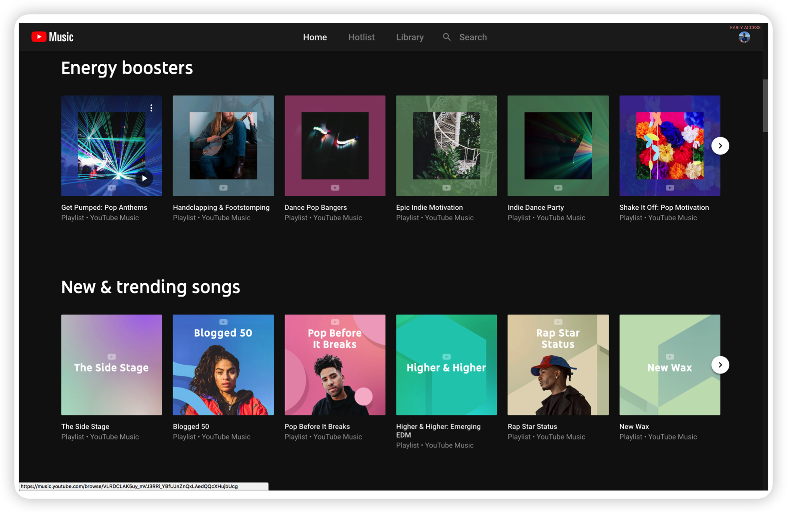
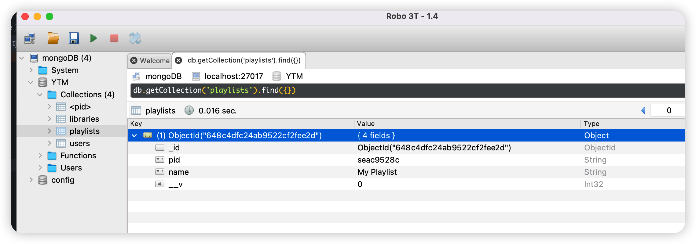
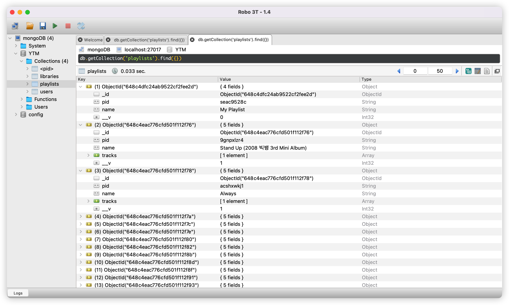
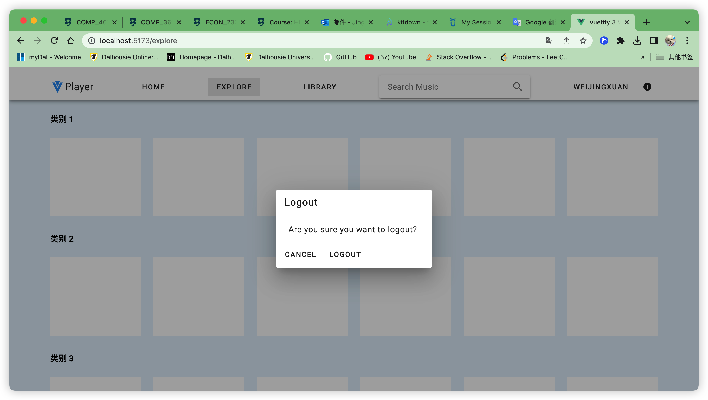
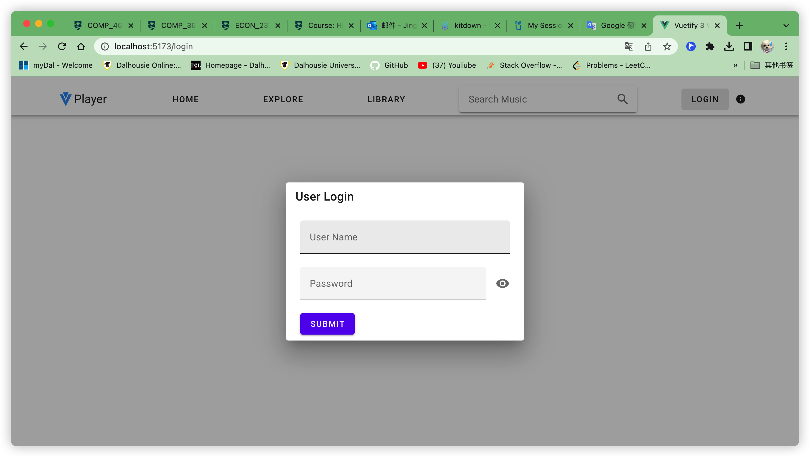
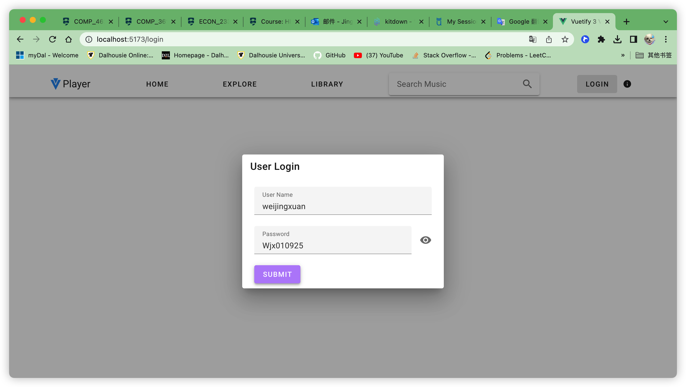
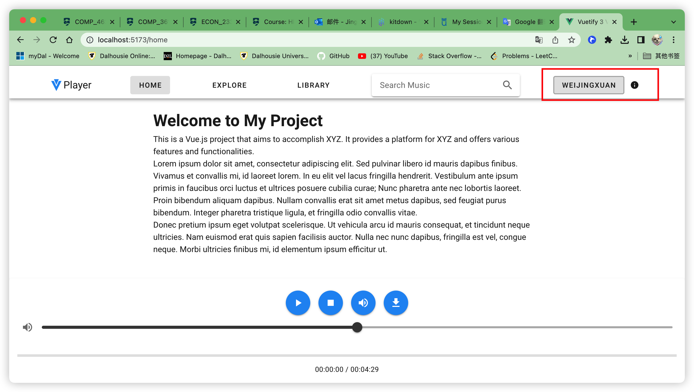
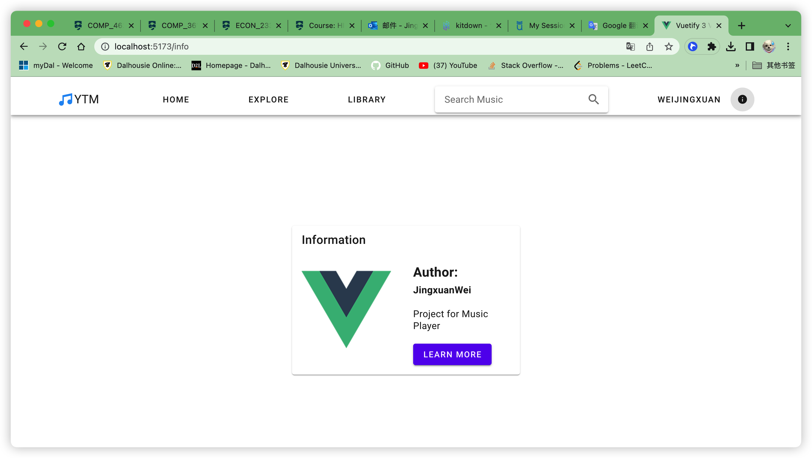

Week 6

前端页面构建

既然都使用JavaScript了，那么我们就不能将视野单纯地停留在后端。作为一个面向用户的音乐平台，如果单纯只 是使用PostMan等工具进行枯燥的API调试的话，必然非常无趣，并且难度大幅提高。

在本环节，要求用户接触和熟悉最知名的MVVM前端框架Vue，并且使用Vue的快捷UI库Vuetify构建一个音乐播放 器界面和登录界面。

与上述界面类似，顶栏仅保留两个部分，Explore和Library

Explore页面以Album为单位展示Library中所有的歌曲——没错，这也就意味着，在libraryInit的时候，程序还应当 在构建曲库的过程中，对每一个文件的Album进行唯一索引，创建一个单独的Playlist，pid为随机生成。这个步骤 将会把所有歌曲按照Album创建集合。

Library页面为用户私人的Library，展示了用户自己的歌曲收藏以及playlist收藏。

## 任务1

在libraryInit补充上述逻辑

## 任务2

vuetify：https://vuetifyjs.com/zh-Hans/getting-started/installation/

另起一个项目文件夹，名为ytm-vuetify

学习和了解vue模板引擎的用法， 使用vuetify构建一个音乐播放器的 界面。 

音乐播放本身已经有现成的界面：https://github.com/WoodyDark/vuetify-audio-player 这一组件应当浮动并且始终位于屏幕最下方。 这一部分，文字和图片信息全部使用预先写好值的填充，只需要构建界面。

## 任务3

使用Vuetify构建一个用户登录 & 注册的界面。 在理解了Vue的 /login 登陆页面 /explore 曲库探索页面 /library 个人库页面 /playlist/<pid> 播放列表页面 /album/<pid> 专辑页面 具体的UI样式，直接参考Youtube Music 如果没有前端基础，这一部可以使用较长的学习和实践时间（一个星期）

可以播放

