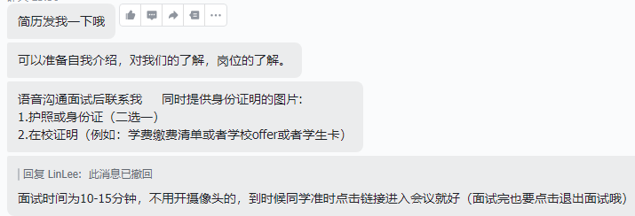

# 谷歌Alphabet 软件开发实习生

## 岗位职责

1、对开源项目进行研究；
2、参检索系统开发以及性能优化；
3、应用深度学习模型和算法技术，对文本、图像、视频等数据进行分析、建模、持续调优。

##  岗位要求 

1、计算机、工程软件及相关理工类专业的大三及以上学生；
2、具备至少种一编程语言的识知和理解能力，比如：Java、Python、C；
3、具备良好的计算机基础知识，比如数据结构和法算；
4、工作积极主动，沟通能力强。

# 自我介绍

您好,我的名字叫魏靖轩, 我是加拿大Dalhousie 大学的的应届准毕业生, 我的预计毕业时间是2023年的夏季, 想在毕业之前有一段优秀的实习经历, 来为我的简历增色.     ( 虽然我的学校在QS的排名并不是很高, 但是在加拿大还是还不错的, 并且我也有在大学期间好好学习)

因为我想在之后的日子里, 能在加拿大的本地计算机公司有一份好的工作, 并且在我的城市halifax拿到绿卡, 所以我很希望能通过这个实习,增加积累我的经验, 帮助我在日后的面试和工作中更能得心应手.

在之前的时间, 因为疫情导致了在这边没有很多实习的机会, 所以我就尽快的完成了课程学业, 在现在想进行一段软件开发的实习. 因为比较热爱软件开发的这个行业吧

我本人是比较热爱计算机的, 因为从高中的时候, 就有一直在接触计算机, 特别喜欢在Github上面寻找并研究开源的软件, 比如在高三的时候SNKRS抢鞋, 我就有试图通过制作一个软件来帮助我提高反应, 当然最终是因为在当时能力不足以失败告终了.  

# Alphabet

**Alphabet**公司是美国的[控股公司](https://zh.wikipedia.org/wiki/控股公司)，由[Google公司](https://zh.wikipedia.org/wiki/Google)组织分割而来，在重组之后有了很多的分部门, 其中就包括谷歌.

# 对于岗位来说

1、对开源项目进行研究；
2、参检索系统开发以及性能优化；
3、应用深度学习模型(这个我并不是特别在行, 我在今年的暑假有学习机器学习的课程, 但是目前并没有) 和算法技术，对文本、图像、视频等数据进行分析、建模、持续调优。

##  岗位要求 

Java 是我最喜欢的一门语言, 因为他比C语言要更加智能, 添加了垃圾回收, 我也不用去管理内存, 防止内存的泄露, 所以我大三的课程中都是以Java的开发为主, 比如Springboot的开发, 正如我简历中所说的项目Trello, 就是使用Springboot进行开发的微服务项目. 

计算机基础知识都较为熟悉, 如果有不足的地方我也会在日后进行笔记的整理，今年我完成了数据结构的课程, 了解了很多的树和字符串算法；对于Leetcode上面的算法, 我也在当自己空闲的时候回进行刷题和学习.

我对工作的态度是积极主动的因为我觉得学习是为了自己, 多积累一些经验是好处, 学习更多的知识, 比较乐于学习吧, 如果需要完成的部分需要我去学习更多的知识, 我会很乐意! 我会在onenote进行笔记整理, 收集知识点信息，我也可以与人良好的进行沟通, 善于表达自己的观点, 特别是如果用中文的话! 